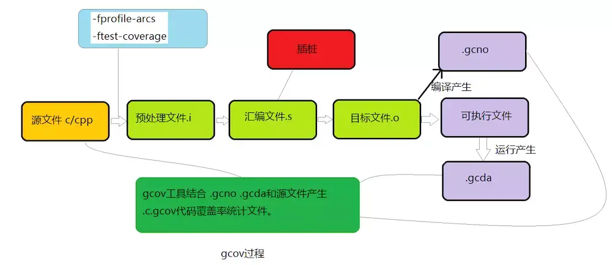
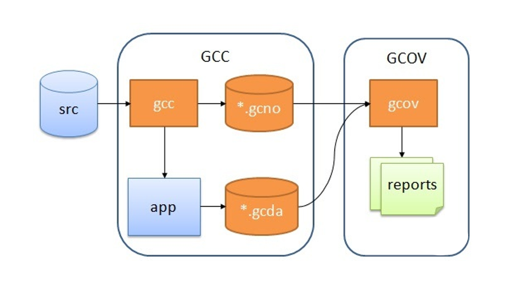

# unit test coverage

## 简介

单测覆盖率报告。

## GCC 单测



GCC 在编译阶段指定 `–ftest-coverage` 等覆盖率测试选项后，GCC 会：

1. 在输出目标文件中留出一段存储区保存统计信息
2. 在源代码中每行可执行语句生成的代码之后附加一段更新覆盖率统计结果的代码，也就是“插桩”
3. GCC 编译会生成 `*.gcno` 文件，它包含重建基本块图和相应块源码的行号信息
4. 在最终可执行文件中，进入 main 函数后调用 `gcov_init` 内部函数初始化统计数据区，并将 `gcov_exit` 内部函数注册为 `exit_handers`，用户代码调用 exit 正常结束时，`gcov_exit` 函数被调用，并继续调用 `__gcov_flush` 输出统计数据到 `*.gcda` 文件。

## Blade 单测

通过如下命令我们可以生成 `*.gcno` 和 `*.gcda` 数据文件：

```bash
$blade test ... --full-test --run-unrepaired-tests --coverage

$find build64_release/ -name *.gcda
build64_release/logger/logger.objs/logger.cc.gcda
build64_release/logger/logger.objs/backtrace.cc.gcda
build64_release/logger/logger.objs/sync_file_appender.cc.gcda
build64_release/logger/logger.objs/file_appender.cc.gcda
build64_release/logger/logger.objs/async_file_appender.cc.gcda
build64_release/logger/logger.objs/log_capture.cc.gcda
build64_release/util/sync/rcu_ptr_test.objs/rcu_ptr_test.cc.gcda
build64_release/util/sync/thread_safe_queue_test.objs/thread_safe_queue_test.cc.gcda
build64_release/util/sync/cow_ptr_test.objs/cow_ptr_test.cc.gcda
build64_release/util/macros/macros_test.objs/macros_test.cc.gcda
build64_release/util/util.objs/threadpool.cc.gcda
build64_release/util/json_helper/unit_test/common_test.objs/common_test.cc.gcda
build64_release/util/json_helper/unit_test/json_helper_test.objs/json_helper_test.cc.gcda
build64_release/util/json_helper/unit_test/unmarshal_test.objs/unmarshal_test.cc.gcda
build64_release/util/json_helper/unit_test/marshal_test.objs/marshal_test.cc.gcda
build64_release/util/threadpool_test.objs/threadpool_test.cc.gcda

$find build64_release/ -name *.gcno
build64_release/logger/logger.objs/sync_file_appender.cc.gcno
build64_release/logger/logger.objs/backtrace.cc.gcno
build64_release/logger/logger.objs/log_capture.cc.gcno
build64_release/logger/logger.objs/async_file_appender.cc.gcno
build64_release/logger/logger.objs/logger.cc.gcno
build64_release/logger/logger.objs/file_appender.cc.gcno
build64_release/logger/logger.objs/log_kv.cc.gcno
build64_release/logger/test/funny_test.objs/funny_test.cc.gcno
build64_release/logger/test/signal8_test.objs/signal8_test.cc.gcno
build64_release/logger/test/logger_test.objs/logger_test.cc.gcno
build64_release/main/main.objs/main.cc.gcno
build64_release/util/sync/rcu_ptr_test.objs/rcu_ptr_test.cc.gcno
build64_release/util/sync/thread_safe_queue_test.objs/thread_safe_queue_test.cc.gcno
build64_release/util/sync/cow_ptr_test.objs/cow_ptr_test.cc.gcno
build64_release/util/macros/macros_test.objs/macros_test.cc.gcno
build64_release/util/util.objs/threadpool.cc.gcno
build64_release/util/json_helper/example/unmarshal.objs/unmarshal.cc.gcno
build64_release/util/json_helper/example/marshal.objs/marshal.cc.gcno
build64_release/util/json_helper/unit_test/common_test.objs/common_test.cc.gcno
build64_release/util/json_helper/unit_test/json_helper_test.objs/json_helper_test.cc.gcno
build64_release/util/json_helper/unit_test/unmarshal_test.objs/unmarshal_test.cc.gcno
build64_release/util/json_helper/unit_test/marshal_test.objs/marshal_test.cc.gcno
build64_release/util/threadpool_test.objs/threadpool_test.cc.gcno
build64_release/scm.cc.gcno
```

## GCOV

gcov 工作流程如下：



1. 在 GCC 编译时加入特殊的编译选项，生成可执行文件和 `*.gcno`
2. 运行可执行文件，生成 `*.gcda` 数据文件
3. 有了 `*.gcno` 和 `*.gcda`，通过源码生成 `gcov` 文件，最终生成代码覆盖率报告

## gcovr 生成单测覆盖率

安装 gcovr：

```bash
pip install gcovr

# 网络问题的话可以使用国内镜像加速
pip install gcovr -i https://pypi.tuna.tsinghua.edu.cn/simple/
```

可以使用 gcovr 生成单测覆盖率：

```bash
mkdir -p coverage_reports
gcovr -r . --html --html-details -o coverage_reports/coverage_report.html
```

启动 HTTP 服务器方便查看单测覆盖率：

```bash
cd coverage_reports && python3 -m http.server 8080
```

## Reference

[1] <https://www.zhihu.com/question/265566651/answer/2519366019>
