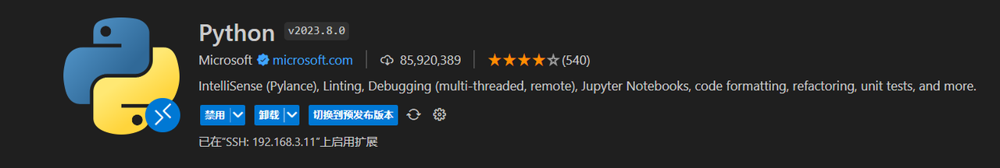
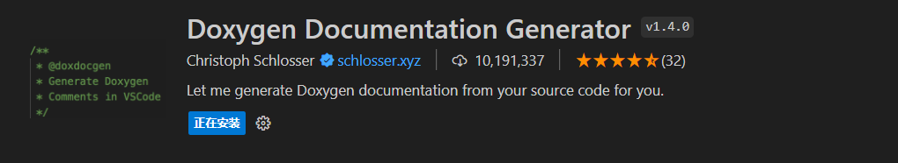

# VSCode

## C++ 开发

### 1. Clangd

首先安装 Clangd 插件。


还需要安装 clangd 二进制程序：

```bash
sudo apt install -y clangd
```

对应的配置：

```json
{
    "editor.inlayHints.enabled": "off",
}
```

### 2. Clang-Format

安装 Clang-Format 插件：


还需要安装 clang-format 二进制：

```bash
sudo apt install -y clang-format
```

对应的配置放在 `.clang-format` 配置文件中：

### 3. cpplint

google 编码规范对应的提示插件，需要安装插件：


安装对应的 cpplint 二进制：

```bash
$ pip install cpplint

# 报错的话可以使用国内镜像
$ pip install cpplint -i http://mirrors.aliyun.com/pypi/simple/ --trusted-host mirrors.aliyun.com
$ sudo ln -s ~/.local/bin/cpplint /usr/bin/cpplint
```

对应的配置：

```json
{
    "cpplint.lineLength": 200, // 设置行长度
    "cpplint.filters": [
        "-legal/copyright",
        "-whitespace/ending_newline",
        "-build/c++11",
        // "-runtime/references",
        // "-build/include_subdir",
        // "-readability/todo",
        // "-build/include_order",
        // "-readability/casting",
        // "-whitespace/line_length"
    ],
    "cpplint.cpplintPath": "/home/cat/.local/bin/cpplint",
}
```

### 4. Blade

为了给 blade 的 BUILD 配置文件提供语法提示（python），需要安装 python：



同时需要安装 lint 工具：


## 辅助插件

### 1. CodeGeexX

ai 插件，可以辅助写代码。

### 2. Code Spell Checker

拼接检查：


### 3. Doxygen Documentation Generator

用于生成 C++ 注释：



### 4. MarkdownLint

格式化 Markdown：


配置：

```json
{
    "[markdown]": {
        "editor.formatOnSave": true,
        "editor.formatOnPaste": true,
        "editor.defaultFormatter": "DavidAnson.vscode-markdownlint"
    },
    "markdownlint.ignore": [
        ".clang-format",
        "**/.clang-format"
    ],
}
```
