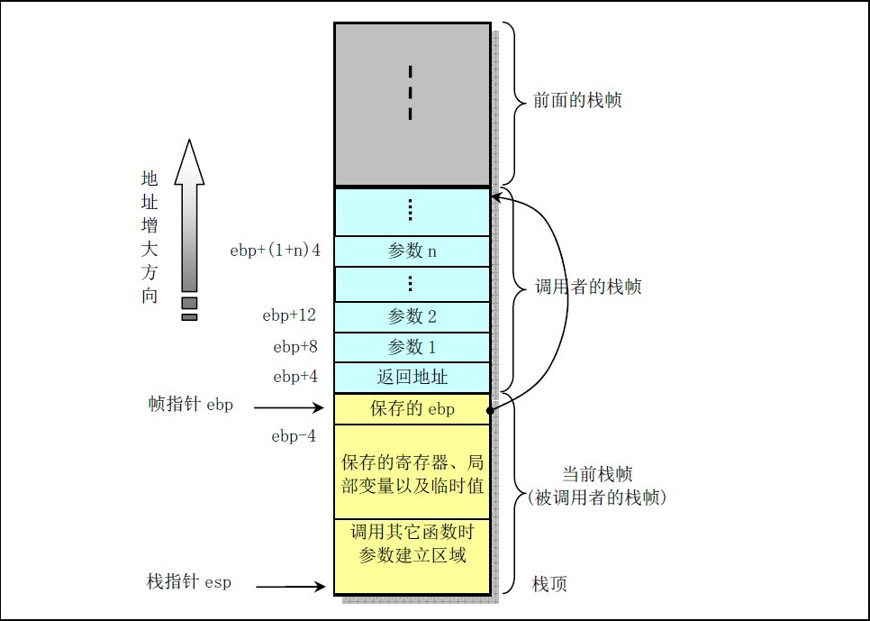
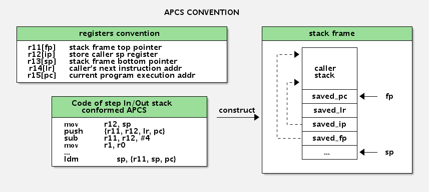
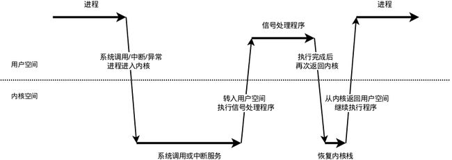
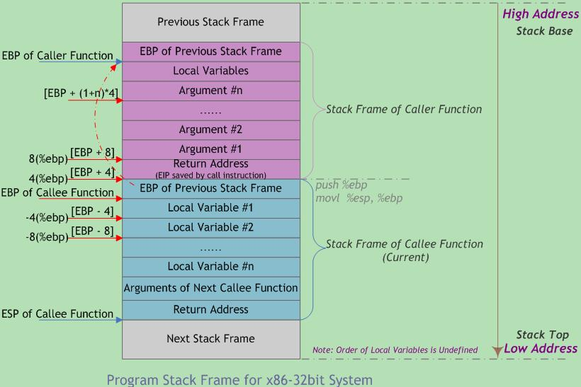
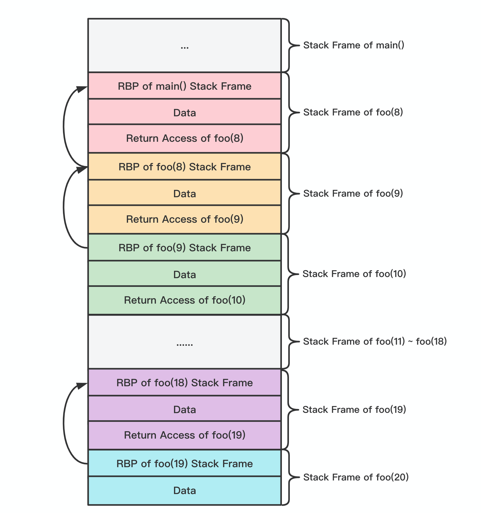
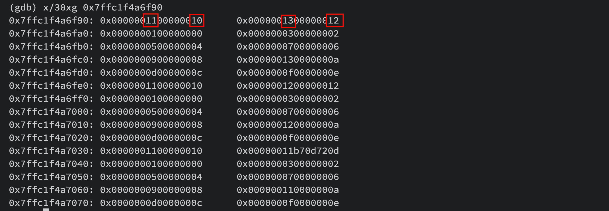
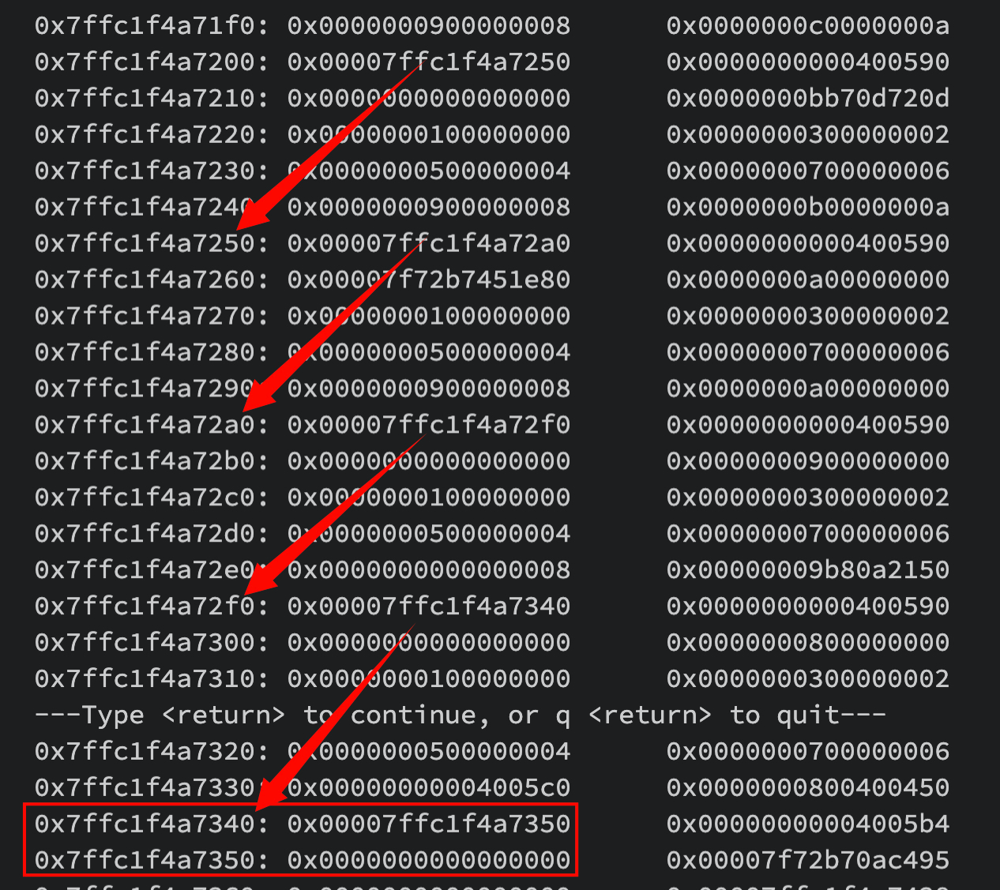
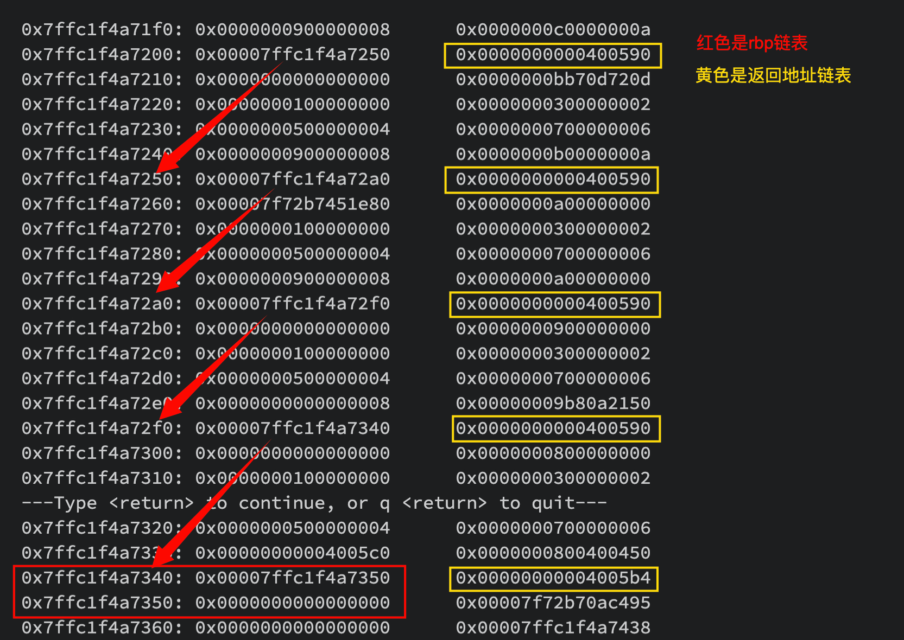

# coredump 分析

## 栈帧原理

X86函数栈帧结构：



ARM函数栈帧结构：



## 前言

当程序发生内存越界访问等行为时，会触发 OS 的保护机制，此时OS会产生一个信号（signal）发送给对应的进程。当进程从内核态到用户态切换时，该进程会处理这个信号。此类信号（比如SEGV）的默认处理行为生成一个 coredump 文件。

### 1. 打开 coredump

`ulimit -c` 命令可以查看 coredump 是否打开，如果输出为 0 表示没有打开，输出为`unlimited`表示 coredump 打开：

```bash
# 打开coredump
$ulimit -c unlimited

# 关闭coredump
$ulimit -c 0
```

### 2. 产生 coredump 的信号

```bash
Signal     Value     Action   Comment
     ──────────────────────────────────────────────────────────
     SIGHUP        1       Term    Hangup detected on controlling terminal
                                   or death of controlling process
     SIGINT        2       Term    Interrupt from keyboard
     SIGQUIT       3       Core    Quit from keyboard
     SIGILL        4       Core    Illegal Instruction
     SIGABRT       6       Core    Abort signal from abort(3)
     SIGFPE        8       Core    Floating point exception
     SIGKILL       9       Term    Kill signal
     SIGSEGV      11       Core    Invalid memory reference
     SIGPIPE      13       Term    Broken pipe: write to pipe with no
                                   readers
     SIGALRM      14       Term    Timer signal from alarm(2)
     SIGTERM      15       Term    Termination signal
     SIGUSR1   30,10,16    Term    User-defined signal 1
     SIGUSR2   31,12,17    Term    User-defined signal 2
     SIGCHLD   20,17,18    Ign     Child stopped or terminated
     SIGCONT   19,18,25    Cont    Continue if stopped
     SIGSTOP   17,19,23    Stop    Stop process
     SIGTSTP   18,20,24    Stop    Stop typed at terminal
     SIGTTIN   21,21,26    Stop    Terminal input for background process
     SIGTTOU   22,22,27    Stop    Terminal output for background process
```

这里，我们可以看到3、4、6、8、11默认都会产生core行为。

### 3. coredump 文件保存路径

`/proc/sys/kernel/core_pattern` 指定 core 文件存储的位置，缺省值是 core，表示将 core 文件存储到当前目录。

这个 pattern 是可以定制的，模式如下：

```bash
%p  出Core进程的PID
%u  出Core进程的UID
%s  造成Core的signal号
%t  出Core的时间，从1970-01-0100:00:00开始的秒数
%e  出Core进程对应的可执行文件名
```

`/proc/sys/kernel/core_uses_pid` 取值是 0 或者 1，表示是否在 core 文件名字后面加上进程号。

### 4. coredump 文件保存内容

`/proc/$pid/coredump_filter` 设置那些内存会被 dump 出来，需要在程序启动之后进行设置。

```bash
bit 0  Dump anonymous private mappings.
bit 1  Dump anonymous shared mappings.
bit 2  Dump file-backed private mappings.
bit 3  Dump file-backed shared mappings.
bit 4 (since Linux 2.6.24)
       Dump ELF headers.
bit 5 (since Linux 2.6.28)
       Dump private huge pages.
bit 6 (since Linux 2.6.28)
       Dump shared huge pages.
```

默认设置是 33,也就是保留了 bit 位对应的 0 和 5 对应的内存。

#### 5. 设置 core 文件大小

`ulimit -c` 决定 save 的 core 文件大小限制. 如果不想限制大小，需要设置 `ulimit -c unlimited`。

## 信号捕获处理

### 1. 信号机制

在 Linux 中，信号是进程间通讯的一种方式，它采用的是异步机制。当信号发送到某个进程中时，操作系统会中断该进程的正常流程，并进入相应的信号处理函数执行操作，完成后再回到中断的地方继续执行。

> 需要注意的是，信号只是用于通知进程发生了某个事件，除了信号本身的信息之外，并不具备传递用户数据的功能。

### 2. 信号处理流程

既然信号是异步的，这就涉及信号何时接收、何时处理的问题。

我们知道，函数运行在用户态，当遇到系统调用、中断或是异常的情况时，程序便需要进入内核态。信号涉及到了这两种状态之间的转换，过程可以先看一下下面的示意图：



我们把这个过程拆分成信号的接收、检测、处理三个步骤。

#### 2.1 信号接收

接收信号的任务是由内核代理的，当内核接收到信号后，会将其放到对应进程的信号队列中，同时向进程发送一个中断，使其陷入内核态。我们将进程刚接收到信号并未处理的那种状态称为信号未决（Pending）。

注意，此时信号还只是在队列中，对进程来说暂时是不知道有信号到来的。

#### 2.2 信号检测

进程陷入内核态后，有两种场景会对信号进行检测：

* 进程从内核态返回到用户态前进行信号检测
* 进程在内核态中，从睡眠状态被唤醒的时候进行信号检测

当发现有新信号时，便会进入下一步，信号的处理。

#### 2.3 信号处理

信号处理函数是运行在用户态的，之所以如此是由于若处于内核态程序便拥有过高的权利会对系统有潜在的危险，故调用处理函数前，内核会将当前内核栈的内容备份拷贝到用户栈上，并且修改指令寄存器（eip）将其指向信号处理函数。

接下来进程返回到用户态中，执行相应的信号处理函数。

信号处理函数执行完成后，还需要返回内核态，检查是否还有其它信号未处理。如果所有信号都处理完成，就会将内核栈恢复（从用户栈的备份拷贝回来），同时恢复指令寄存器（eip）将其指向中断前的运行位置，最后回到用户态继续执行进程。

至此，一个完整的信号处理流程便结束了，如果同时有多个信号到达，上面的处理流程会在第 2 步和第 3 步骤间重复进行。

### 3. 信号来源

信号来自于内核，生成信号的请求来自于以下三个地方：

* 用户：用户可以通过输入 `Ctrl+C` 和 `Ctrl+\` 等命令，或是终端驱动程序分配给信号控制字符的其他任何键来请求内核产生信号。
* 内核：当进程执行出错时， 内核给进程发送一个信号。 例如，非法段存取，浮点数溢出，亦或是一个非法指令，内核也利用信号通知进程特定事件发生。
* 进程：一个进程可以通过系统调用 kill 给另外一个进程发送信号， 一个进程可以和另一个进程通过信号通信。

### 4. 进程处理信号的方式

进程能够通过系统调用 `signal()` 告诉内核， 它要如何处理信号，进程处理信号的方式包含如下三种。

#### 4.1 接收默认处理（通常是消亡）

SIGINT 的默认处理是消亡， 进程并不一定要使用 `signal()` 接收默认处理，但是进程能够通过以下调用来恢复默认处理。

```c
signal(SIGINT, SIG_DFL);
```

#### 4.2 忽略信号

程序可以通过以下调用来告诉内核， 它需要忽略 SIGINT。

```c
signal(SIGINT, SIG_IGN);
```

#### 4.3 自定义信号处理函数

 程序能够告诉内核，当程序到来时应该调用哪个函数。

```c
signal(signum, functionname);
```

### 5. 多线程下的信号处理

> **A signal may be directed to either the process as a whole or to a specific thread**. A signal is thread-directed if it is generated as the direct result of the execution of a specific hardware instruction within the context of the thread (**`SIGBUS, SIGFPE, SIGILL, and SIGSEGV`**)

信号可以发给整个进程，也可以发给特定线程：

* 发给整个进程的信号，随机选取一个线程进行执行
* 发给特定线程的信号，只能由特定的线程负责处理。一些信号如果是某些线程代码的直接执行而引发，那么只能由特定的线程负责执行，例如 `SIGBUS, SIGFPE, SIGILL, SIGSEG`。

## 自定义信号处理函数

在实际生产环境中 core 文件处于默认关闭的状态（因为线上程序运行产生的 core 文件往往比较大）。这种情况下我们需要自定义信号处理函数来取代默认的 core 行为 coredump，一般的信号处理函数都是保留 crash 时候对应的函数调用堆栈：

```c++
// 注册信号处理函数
signal(SIGSEGV, DumpTraceback);
void DumpTraceback(int Signal)
{
    const int len = 200;
    void* buffer[len];
    int nptrs = ::backtrace(buffer, len);
    char** strings = ::backtrace_symbols(buffer, nptrs);
    printf("sig:%d nptrs:%d\n", Signal, nptrs);
    if (strings) {
        for (int i = 0; i < nptrs; ++i) {
            printf("line=%d||trace_back=%s||\n", i, strings[i]);
        }
        free(strings);
    }
    exit(1);
}
```

### 1. 常见问题

#### 1.1 问题一：信号处理函数没有执行 exit 会发生什么？

注意上文 `DumpTraceback()` 函数末尾我们执行了 `exit()` 函数。如果没有这一行的话 crash 就会一直进行下去：因为原线程的执行流程并没有被打断，在信号处理函数执行完毕之后会继续运行到 crash 信号产生的那一行代码。

#### 1.2 问题二：为何存在 crash 堆栈没有打印完全的情况？

从问题一出发，因为某个线程调用了 `exit`，所以所有的线程都会退出。另外，`exit` 会清理该进程申请的所有资源，也会刷新对应的键盘缓冲区，所以会导致某些线程的堆栈并没有被完全打印。

这里需要注意一点：exit 是一个 c 语言中的函数，不是一个 c++ 中的函数，自然不满足 RAII 原则。因此，exit 不会清理对应的 C++ 对象，包括 ostream、特定对象的析构函数等等。

#### 1.3 问题三：是否可以在自定义信号处理函数的同时产生 core 文件？

我们可以通过在信号处理函数中继续产生对应信号，同时更改信号处理函数指针。

```c++
// this is the trick: it will trigger the core dump
signal(signum, SIG_DFL);
kill(getpid(), signum);
```

#### 2. 信号处理函数的潜在死锁问题

`malloc` 等内存分配函数是非异步信号安全的，其内部维护了一个锁。线程中 `malloc` 函数获取锁之后被 signal 中断，在 signal 处理函数中继续调用 `malloc` 就会造成死锁。

因此信号处理函数应尽可能简单，避免直接或间接使用锁、信号量和条件变量等线程同步操作。

## coredump 信号种类

默认行为含有 coredump 的信号种类如下：

| 信号    | 值   | 发出信号的原因             |
| ------- | ---- | -------------------------- |
| SIGQUIT | 3    | Quit from keyboard         |
| SIGILL  | 4    | Illegal instruction        |
| SIGABRT | 6    | Abort signal from abort(3) |
| SIGFPE  | 8    | Floating point exception   |
| SIGSEGV | 11   | Invalid memory reference   |

### 1. SIGQUIT

与 SIGINT 类似，但由 QUIT 字符（通常是 `Ctrl+\`）来控制，进程在因收到 SIGQUIT 退出时会产生 core 文件，在这个意义上类似于一个程序错误信号。引发 coredump 的地点完全是随机的, 可以发生在任何一条指令执行之后。

### 2. SIGILL

SIGILL 是某个进程中的某一句不能被 CPU 识别指令，这些指令可能是一些形式错误、未知或者特权指令。

一般情况下我们的程序指令都是编译器生成的，正常情况下可以认为编译器不会生成非法指令。如果在程序运行过程中出现了 SIGILL 对应的错误，有如下几种可能。

#### 2.1 错误修改代码段

进程代码段中数据是作为指令运行的，如果不小心代码段被错误覆盖，那么 CPU 可能无法识别对应的代码，进而造成 Illegal Instruction。

同样，如果栈被不小心覆盖了，造成返回地址错误、CPU 跳转到错误地址，执行没有意义的内存数据，进而造成 Illegal Instruction。

进一步可以认为，任何导致代码段错误的问题都可能带来 Illegal Instruction。

#### 2.2 指令集演进

CPU 的指令集在不停演进，如果将较新指令集版本的程序在老版本 CPU 上运行，则老版本 CPU 运行时会有 Illegal Instruction 问题。

#### 2.3 工具链 Bug

编译器 (汇编器或者连接器) 自身的 bug，有可能生成 CPU 无法识别的指令。

#### 2.4 内存访问对齐或浮点格式问题

出现错误的指令可能和访存地址指令有关。 另外，浮点数的格式是否符合 IEEE 的标准也可能会有影响。

#### 3. SIGABRT

`abort()` 函数触发，用于严重错误下的场景，程序异常退出，不做任何资源清理。

常见的场景包括：

* `assert` 判定失败
* libc 或者其他的与内存管理相关的 lib 等，异常退出
* `malloc()/free()` will call `abort()` if its internal structures are damaged by a heap overflow.（例如多次 free）

#### 4. SIGFPE

FPE 是 floating-point exception（浮点异常）的缩写，但是产生 SIGFPE 信号并非一定要涉及到浮点算术，一般都是因为进程执行了一个错误的算术操作。

一个通常的疏忽是认为除零异常时 SIGFPE 的唯一来源。在一些架构上使用 `INT_MIN/(-1)` 也会触发这个信号，因为商是一个无法被表示的正数。（`INT_MIN` 是最小的可以被表示的负整数值，例如 8 位有符号正数可以表示 `-128~127` 范围，`-128 / (-1) = 128` 产生溢出而触发 SIGFPE 信号）

#### 5. SIGSEGV

在 POSIX 兼容的平台上，**SIGSEGV** 是当一个进程执行了一个无效的内存引用，或发生段错误时发送给它的信号。

#### 5.1 非法内存引用

内存地址不在进程的地址空间之内：

* 以空指针为代表的程序起始空间
* 未申请的堆空间
* 段与段之间的空洞

内存地址空间合法，但是权限不满足：

* 对代码段进行写操作：野指针，向代码段进行写操作
* 对数据段进行执行操作：rip 错误，把数据段的数据当作指令来执行

#### 5.2 合法的内存地址引用

##### 5.2.1 尚未申请的栈空间

这里需要说明的是，栈空间的管理和堆空间不同：栈空间在程序启动之后，就已经是一次性申请成功，这个申请和实际栈上变量的多少没有关系。

我们常说的栈空间的申请，默认是指 ESP 寄存器的移动，表示栈空间的合法性。但是实际上，小于 ESP（因为栈向低地址增长，所以小于 ESP 的空间，本质上是“未申请”的）的部分，也是合法的栈空间。

```c++
// stack_space.cpp
int main() {
    int a[10];
    // a[-100] 对应的栈空间虽然没有申请, 但是合法的
    a[-100] = 10;
    return 0;
}
```

##### 5.2.2 数组越界到合法的空间

堆空间是需要程序员手动申请和管理的。需要注意的是：

* 出于内存对齐和减少内存碎片的角度考虑，内存分配函数并不是用户申请多少就新增多少，而是有一个额外 buffer
* 如果一次性申请比较大的内存，对应的区域不在狭义的“堆”上，而是在 mmap 区域

```c++
// heap_buffer.cpp
#include<stdlib.h>
#include<stdio.h>
int main() {
    int size = 10;
    char *chs = reinterpret_cast<char *>(malloc(size));
    // chs[size+1] 对应的空间虽然“越界”, 但是“合法”
    printf("%p, %d, size: %d\n", chs, chs[size+1], size);
    return 0;
}

// $g++ -g heap_buffer.cpp -o heap_buffer
// $./heap_buffer
// 0xa1e010, 0, size: 10
```

## 实例

### 1. SIGQUIT 实例

`ctrl + \` 触发的 SIGQUIT：

```c++
// quit.cpp
#include <unistd.h>

int main() {
    sleep(10);  // 睡眠10秒, 在程序执行一半时`ctrl + \`
}
```

编译运行：

```bash
$g++ -g quit.cpp -o quit
$./quit 
^\Quit (core dumped)
```

### 2. SIGILL 实例

暂无，后续碰上了再补充。

### 3. SIGFPE 实例

除零异常触发的 SIGFPE：

```c++
// fpe.cpp
int main() {
    int x = 52 / 0;
    return 0;
}
```

编译运行：

```bash
$g++ -g fpe.cpp -o fpe
$./fpe 
Floating point exception (core dumped)
```

### 4. SIGABRT 实例

#### 4.1 double free 触发 SIGABRT

```c++
// abort.cpp
int main() {
    int* pi = new int(10);
    delete pi;
    delete pi;
    return 0;
}
```

编译运行：

```bash
$g++ -g abort.cpp -o abort 
$./abort
*** Error in `./abort': double free or corruption (fasttop): 0x00000000021fd010 ***
======= Backtrace: =========
/lib64/libc.so.6(+0x81329)[0x7f157a972329]
./abort[0x4006a4]
/lib64/libc.so.6(__libc_start_main+0xf5)[0x7f157a913555]
./abort[0x4005a9]
======= Memory map: ========
00400000-00401000 r-xp 00000000 08:10 88861                              /root/test/abort/abort
00600000-00601000 r--p 00000000 08:10 88861                              /root/test/abort/abort
00601000-00602000 rw-p 00001000 08:10 88861                              /root/test/abort/abort
021fd000-0221e000 rw-p 00000000 00:00 0                                  [heap]
7f1574000000-7f1574021000 rw-p 00000000 00:00 0 
7f1574021000-7f1578000000 ---p 00000000 00:00 0 
7f157a8f1000-7f157aab5000 r-xp 00000000 08:10 22521                      /usr/lib64/libc-2.17.so
7f157aab5000-7f157acb4000 ---p 001c4000 08:10 22521                      /usr/lib64/libc-2.17.so
7f157acb4000-7f157acb8000 r--p 001c3000 08:10 22521                      /usr/lib64/libc-2.17.so
7f157acb8000-7f157acba000 rw-p 001c7000 08:10 22521                      /usr/lib64/libc-2.17.so
7f157acba000-7f157acbf000 rw-p 00000000 00:00 0 
7f157acbf000-7f157acd4000 r-xp 00000000 08:10 22597                      /usr/lib64/libgcc_s-4.8.5-20150702.so.1
7f157acd4000-7f157aed3000 ---p 00015000 08:10 22597                      /usr/lib64/libgcc_s-4.8.5-20150702.so.1
7f157aed3000-7f157aed4000 r--p 00014000 08:10 22597                      /usr/lib64/libgcc_s-4.8.5-20150702.so.1
7f157aed4000-7f157aed5000 rw-p 00015000 08:10 22597                      /usr/lib64/libgcc_s-4.8.5-20150702.so.1
7f157aed5000-7f157afd6000 r-xp 00000000 08:10 22575                      /usr/lib64/libm-2.17.so
7f157afd6000-7f157b1d5000 ---p 00101000 08:10 22575                      /usr/lib64/libm-2.17.so
7f157b1d5000-7f157b1d6000 r--p 00100000 08:10 22575                      /usr/lib64/libm-2.17.so
7f157b1d6000-7f157b1d7000 rw-p 00101000 08:10 22575                      /usr/lib64/libm-2.17.so
7f157b1d7000-7f157b2c0000 r-xp 00000000 08:10 22803                      /usr/lib64/libstdc++.so.6.0.19
7f157b2c0000-7f157b4c0000 ---p 000e9000 08:10 22803                      /usr/lib64/libstdc++.so.6.0.19
7f157b4c0000-7f157b4c8000 r--p 000e9000 08:10 22803                      /usr/lib64/libstdc++.so.6.0.19
7f157b4c8000-7f157b4ca000 rw-p 000f1000 08:10 22803                      /usr/lib64/libstdc++.so.6.0.19
7f157b4ca000-7f157b4df000 rw-p 00000000 00:00 0 
7f157b4df000-7f157b501000 r-xp 00000000 08:10 31827                      /usr/lib64/ld-2.17.so
7f157b6f5000-7f157b6fa000 rw-p 00000000 00:00 0 
7f157b6fe000-7f157b700000 rw-p 00000000 00:00 0 
7f157b700000-7f157b701000 r--p 00021000 08:10 31827                      /usr/lib64/ld-2.17.so
7f157b701000-7f157b702000 rw-p 00022000 08:10 31827                      /usr/lib64/ld-2.17.so
7f157b702000-7f157b703000 rw-p 00000000 00:00 0 
7ffed3837000-7ffed3859000 rw-p 00000000 00:00 0                          [stack]
7ffed3958000-7ffed395c000 r--p 00000000 00:00 0                          [vvar]
7ffed395c000-7ffed395d000 r-xp 00000000 00:00 0                          [vdso]
Aborted (core dumped)
```

需要指出的时，glibc 等 lib 在调用 abort 之前会打印相关信息到 tty，如 `abort.cpp` 所示。但是如果你的程序以 service 的方式运行是看不到这些输出的，此时我们把环境变量 `LIBC_FATAL_STDERR_` 设置成 1，libc 就会把应该输出到 `/dev/tty` 中的信息输出到 `stderr`。

#### 4.2 调用纯虚函数触发 SIGABRT

```c++
// abort.cpp
class Base {
 public:
    virtual void foo() = 0;
    void callFoo() {
        foo();  // 调用纯虚函数
    }
    Base() {
        callFoo();
    }
};

class Derived: Base {
    void foo() {}
};

int main() {
    Derived d;
}
```

编译运行：

```c++
$g++ -g abort.cpp -o abort 
pure virtual method called
terminate called without an active exception
Aborted (core dumped)
```

上述代码在 `Base()` 类的构造函数中使用了虚函数，这种行为在语法上是正确的但是在语义上是错误的。

> Item 9: Never call virtual functions during construction or destruction.

原因在 C++11 标准文档《ISO/IEC 14882:2011(E)》中提及了：

> Member functions can be called from a constructor (or destructor) of an abstract class; the effect of making a virtual call (10.3) to a pure virtual function directly or indirectly for the object being created (or destroyed) from such a constructor (or destructor) is undefined.

即纯虚函数调用的行为是未定义的，而 gcc 的默认实现则是终止程序并输出相关的信息。

### 5. SIGSEGV 实例

#### 5.1 非法的指针解引用

非法指针包括：

* 未初始化的指针
* 空指针
* 已经 free 后的指针

```c++
// nullptr.cpp
#include <unistd.h>
#include <stdlib.h>
#include <iostream>
#include <unordered_map>
#include <cstdio>

#define factor 1024
class Cat {
 public:
    char name[10];
    std::unordered_map<int, int> hash_map;
    int level_1(int a) {
        auto it = hash_map.find(a);
        if (it != hash_map.end()) {
            std::cout << "not find" << std::endl;
        } else {
            std::cout << "found" << std::endl;
        }
        return 0;
    }
};

int main() {
    int a;
    char *chs = reinterpret_cast<char *>(malloc(1024));
    Cat *cat = nullptr;
    printf("address:  a@ %p, chs@ %p, dcp@ %p, &array[0]@ %p, hash_map@ %p\n", &a, chs, cat, &(cat->name[0]), &(cat->hash_map));  // ok
    printf("array[0]:%p\n", cat->name[0]);  // crash
    cat->level_1(0);  // crash
    return 0;
}
```

编译运行：

```bash
$g++ -g nullptr.cpp -std=c++11 -o nullptr
$./nullptr 
address:  a@ 0x7ffd7ea892dc, chs@ 0x1f51010, dcp@ (nil), &array[0]@ (nil), hash_map@ 0x10
Segmentation fault (core dumped)
```

从上面的日志输出我们可以看出，空指针或者野指针的访问，类似于 `p->member` 的形式，仅仅是在把指针 `p` 作为基地址后加上 `member` 的偏移量，并不会去检查指针本身的合法性。如果叠加偏移量后的地址是合法的，那么这个内存访问就是合法的。

上述例子中包含两种 crash 场景：

* 指针对应对象的成员变量访问
* 指针对应对象的成员变量访问：注意，如果成员函数中没有访问成员变量，是不会 crash 的

需要注意的是第二种 crash 的场景比较隐蔽，因为从堆栈中无法直接看出问题所在。

> 在实际的后端开发中，指针必须初始化，因为一个被 nullptr 初始化的指针相对于一个野指针而言更容易排查。

#### 5.2 多线程读写同一个变量

```c++
// mystring.cpp
class mystring {
 public:
    char *pointer;
    int64_t capacity;
    int64_t size;
    mystring operator=(const mystring &input) {
        free(pointer);
        pointer = reinterpret_cast<char *>(malloc(capacity));
        memcopy(pointer, input.pointer, input.size);
        size = input.size;
        capacity =  input.capacity;
        return *this;
    }
}
mystring test, a("hello"), b("world");
// thread1:
test = a;
// thread2:
test = b;
```

上述代码中 thread1 和 thread2 并发，可能导致的问题：

* double free
* 使用 free 之后的内存

STL 中的容器基本都是非线程安全的。由于线程执行顺序的不确定性，多线程下读写同个变量如果出现 crash，那么这个 crash 位置和时机多半也是不确定的。

#### 5.3 可变参数函数参数个数不符合预期

```c++
// printf.cpp
#include <stdio.h>
#include <string>

int main() {
    std::string name = "tomocat";
    printf("%s is programming %s\n", name.c_str());

    return 0;
}
```

编译运行：

```bash
$g++ -g printf.cpp -o printf
$./printf 
Segmentation fault (core dumped)
```

对于可变参数函数，作为被调用方，是不会校验参数的合理性的。被调用方只会去对应的位置（寄存器 或者栈）寻找数值。因此一旦对应位置的垃圾数值不可访问，就会导致 crash 的发生。

#### 5.4 内存越界

内存越界是一个相对比较宽泛的概念，最典型的就是数组下标越界。数组越界导致的结果是不确定的，下面触发 SIGSEGV 的一种情况：

```c++
// array.cpp
#include<cstring>
#include<iostream>
#include<string>

class Foo {
 public:
    // 虚函数
    virtual void virtual_func() {
        std::cout << "call virtual_func()" << std::endl;
    }
    // 普通成员函数
    void member_func() {
        std::cout << "call member_func()" << std::endl;
    }
};

Foo *ptr_foo = nullptr;

void CopyData(char const *szData) {
    Foo foo;
    ptr_foo = &foo;
    char ch[1];
    ptr_foo->virtual_func();  // ok
    ch[8] = 'a';              // 此处的数组下标越界会导致foo对象的虚函数表指针被写入垃圾数值
    foo.member_func();        // ok
    foo.virtual_func();       // ok
    ptr_foo->member_func();   // ok
    ptr_foo->virtual_func();  // crash
}

int main() {
    CopyData("1234567890123456789012345678901234567890");
    return 0;
}
```

编译运行：

```bash
$g++ -g array.cpp -std=c++11 -o array
$./array 
call virtual_func()
call member_func()
call virtual_func()
call member_func()
Segmentation fault (core dumped)
```

上述例子中 `ch[8] = 'a'` 对应的数组越界导致 `foo` 对象的虚函数表指针被写入脏数据，因而导致 `CopyData()` 函数的最后一行调用失败。

由于栈上保存了很多信息，尤其是一些关键寄存器的信息（EIP 和 EBP 等）。这些缓存 2 的寄存器被写入垃圾数值之后，可能导致函数栈回溯失败、非法指令等问题，甚至由此衍生出缓冲区溢出等攻击手段（现代操作系统已经几乎不存在）。一个常见的栈数据破坏性写入的场景是 **使用 strcpy, strcat, sprintf, strcmp, strcasecmp 等字符串操作函数，将目标字符串读/写爆**。

## 调试栈被破坏的 coredump

### 1. code

```c++
// stack_broken.cpp
#include <stdio.h>
#include <string.h>

void foo(int n) {
    printf("The %d step begin.\n", n);
    int a[10];
    for (int i = 0; i< n; i++) {  // n > 10时会导致写入的空间超过了栈上的“合法”内存
        a[i] = i;
    }
    if (n < 20) {
        foo(n +1);
    }
    printf("The %d step end\n", n);
}

int main(void) {
    foo(8);
    return 0;
}
```

编译运行：

```bash
$g++ -g stack_broken.cpp -o stack_broken
$./stack_broken 
The 8 step begin.
The 9 step begin.
The 10 step begin.
The 11 step begin.
The 12 step begin.
The 13 step begin.
The 14 step begin.
The 15 step begin.
The 16 step begin.
The 17 step begin.
The 18 step begin.
The 19 step begin.
The 20 step begin.
The 20 step end
Segmentation fault (core dumped)
```

### 2. 分析

上述这段代码关键在于 `foo()` 函数会有递归调用，在 `n>10` 时会导致数组 `a[10]` 越界，写入空间超过了栈上的“合法”内存。

回顾一下 C++ 的函数调用栈：



我们需要清楚如下几点：

* 正常情况下 ebp 寄存器以及栈上存储的「EBP of Pervious Stack Frame」构成了一个单向链表，链表头是当前执行的函数，其余节点存储了各个层次的调用者函数。
* 所有栈上地址都是合法的（此处的“合法”指的是操作系统允许写入），也就是说即使是写入到 `a[19]` 这样的越界地址也是合法的，并不会触发 crash。
* 由于栈的增长方向是从高地址向低地址，而 **写坏的是“高地址”，即已经申请过的地址空间**。
* 栈上与函数调用最相关的数据是返回地址（Return Address）和上一个栈帧的 EBP（EBP of Previous Stack Frame），而直接导入 crash 的原因是因为返回地址被写入了脏数据，导致执行对应的指令出现问题

 以我们的 `stack_broken.cpp` 为例，在 `foo(20)` 返回时函数调用栈如下：



在 `foo(20)` 函数调用结束后需要执行 `ret` 指令，此时会将地址为 `rbp+8` 对应的栈上数据（即「Return Access of foo(19)」）放入 rip 寄存器中，然后执行 rip 对应的这一条指令。然而由于用户代码将 `rbp+8` 地址的数据写坏了（存放的是一个 0~19 的数字），不是一个合法的指令地址，因此产生了 crash。

### 3. 结论

* 栈被破坏导致 crash 的本质是「Return Address」和「EBP of Previous Stack Frame」的数据被”写坏“导致的。
* 栈上数据错乱不一定会导致 crash，有可能是仅仅把应该写入变量 a 的数据写到了变量 b。
* 栈 crash 时函数的执行已经脱离了出问题的函数。假设 A 调用 B，然后 B 函数发生了栈上空间的错误写入，那么 crash 往往发生在 A 函数之中。这是因为只有 B 函数对应的汇编代码最后一句「retq」执行完毕之后才会发生 crash，此时程序的控制权还在函数 A 中。

#### 4. 恢复函数调用栈

#### 4.1 找到 rbp 链表

需要指出的是被破坏的函数调用栈部分已经无法恢复了，我们仅仅能恢复没有被破坏的部分。恢复函数栈的原理也很简单，那就是根据栈空间中的内存内容，找到那个“rbp 链表”即可。

使用 gdb 调试对应的 core 文件，可以看到「bt」指令无法获取到正确的函数调用栈信息：

```bash
$gdb ./stack_broken core
(gdb) bt
#0  0x0000000f0000000e in ?? ()
#1  0x0000001100000010 in ?? ()
#2  0x0000001300000012 in ?? ()
#3  0x0000000100000000 in ?? ()
#4  0x0000000300000002 in ?? ()
#5  0x0000000500000004 in ?? ()
#6  0x0000000700000006 in ?? ()
#7  0x0000000900000008 in ?? ()
#8  0x000000130000000a in ?? ()
#9  0x0000000d0000000c in ?? ()
#10 0x0000000f0000000e in ?? ()
#11 0x0000001100000010 in ?? ()
#12 0x0000001200000012 in ?? ()
#13 0x0000000100000000 in ?? ()
#14 0x0000000300000002 in ?? ()
#15 0x0000000500000004 in ?? ()
#16 0x0000000700000006 in ?? ()
#17 0x0000000900000008 in ?? ()
#18 0x000000120000000a in ?? ()
---Type <return> to continue, or q <return> to quit---return
```

函数调用栈在回溯过程中会执行如下两条关键指令：

```bash
mov %rbp, %rsp
pop %rbp
```

而回溯行为对应的「retq」指令是在这两条指令执行完后再执行的，因此 `rsp` 寄存器中的值是有效的。我们可以根据 `rsp` 寄存器中的值打印出目前栈空间的数据：

> 「x」命令用于查看内存地址中的值，格式：`x/<n/f/u> <addr>`：
>
> * n 表示要显示的内存单元的个数，一个内存单元的大小由第三个参数 u 定义。
> * f 表示 addr 指向的内存内容的输出格式，s 对应输出字符串，x 表示按十六进制格式显示变量。
>
> * u 表示以多少个字节作为一个内存单元，默认为 4。b 表示 1bytes，h 表示 2bytes，w 表示 4bytes，g 表示 8bytes。

```bash
# 查看rsp寄存器的值, 它原来应该存储foo(19)栈帧的rbp值, 然而被我们越界的数据写坏了
(gdb) info reg rsp
rsp            0x7ffc1f4a6f90   0x7ffc1f4a6f90

# 以rsp为起点, 查看栈空间的数据
(gdb) x/30xg 0x7ffc1f4a6f90
0x7ffc1f4a6f90: 0x0000001100000010      0x0000001300000012
0x7ffc1f4a6fa0: 0x0000000100000000      0x0000000300000002
0x7ffc1f4a6fb0: 0x0000000500000004      0x0000000700000006
0x7ffc1f4a6fc0: 0x0000000900000008      0x000000130000000a
0x7ffc1f4a6fd0: 0x0000000d0000000c      0x0000000f0000000e
0x7ffc1f4a6fe0: 0x0000001100000010      0x0000001200000012
0x7ffc1f4a6ff0: 0x0000000100000000      0x0000000300000002
0x7ffc1f4a7000: 0x0000000500000004      0x0000000700000006
0x7ffc1f4a7010: 0x0000000900000008      0x000000120000000a
0x7ffc1f4a7020: 0x0000000d0000000c      0x0000000f0000000e
0x7ffc1f4a7030: 0x0000001100000010      0x00000011b70d720d
0x7ffc1f4a7040: 0x0000000100000000      0x0000000300000002
0x7ffc1f4a7050: 0x0000000500000004      0x0000000700000006
0x7ffc1f4a7060: 0x0000000900000008      0x000000110000000a
0x7ffc1f4a7070: 0x0000000d0000000c      0x0000000f0000000e
```

下图中红圈部分就是越界数组写坏的栈空间：



从代码上可以看出 `foo(11)` 开始就会出现越界的情况，因此我们多打印出栈空间的数据，跳过「EBP of Previous Stack Frame」被写坏的数据，找到未被破坏的 `rbp` 链表：

```bash
# 打印出以rsp值为起点的256个内存块数据, 每个内存块为8字节
(gdb) x/256xg 0x7ffc1f4a6f90
0x7ffc1f4a6f90: 0x0000001100000010      0x0000001300000012
0x7ffc1f4a6fa0: 0x0000000100000000      0x0000000300000002
0x7ffc1f4a6fb0: 0x0000000500000004      0x0000000700000006
0x7ffc1f4a6fc0: 0x0000000900000008      0x000000130000000a
...
```



#### 4.2 根据 rbp 链表恢复函数调用关系

根据 C++ 函数调用栈结构，我们知道栈上「EBP of Previous Stack Frame」相邻的地址就是「Return Access」。因此我们得到整个函数调用栈「Return Access 链表」为：

```bash
0x7ffc1f4a71f0: 0x0000000900000008      0x0000000c0000000a
0x7ffc1f4a7200: 0x00007ffc1f4a7250      0x0000000000400590
0x7ffc1f4a7210: 0x0000000000000000      0x0000000bb70d720d
0x7ffc1f4a7220: 0x0000000100000000      0x0000000300000002
0x7ffc1f4a7230: 0x0000000500000004      0x0000000700000006
0x7ffc1f4a7240: 0x0000000900000008      0x0000000b0000000a
0x7ffc1f4a7250: 0x00007ffc1f4a72a0      0x0000000000400590
0x7ffc1f4a7260: 0x00007f72b7451e80      0x0000000a00000000
0x7ffc1f4a7270: 0x0000000100000000      0x0000000300000002
0x7ffc1f4a7280: 0x0000000500000004      0x0000000700000006
0x7ffc1f4a7290: 0x0000000900000008      0x0000000a00000000
0x7ffc1f4a72a0: 0x00007ffc1f4a72f0      0x0000000000400590
0x7ffc1f4a72b0: 0x0000000000000000      0x0000000900000000
0x7ffc1f4a72c0: 0x0000000100000000      0x0000000300000002
0x7ffc1f4a72d0: 0x0000000500000004      0x0000000700000006
0x7ffc1f4a72e0: 0x0000000000000008      0x00000009b80a2150
0x7ffc1f4a72f0: 0x00007ffc1f4a7340      0x0000000000400590
0x7ffc1f4a7300: 0x0000000000000000      0x0000000800000000
0x7ffc1f4a7310: 0x0000000100000000      0x0000000300000002
---Type <return> to continue, or q <return> to quit---
0x7ffc1f4a7320: 0x0000000500000004      0x0000000700000006
0x7ffc1f4a7330: 0x00000000004005c0      0x0000000800400450
0x7ffc1f4a7340: 0x00007ffc1f4a7350      0x00000000004005b4
0x7ffc1f4a7350: 0x0000000000000000      0x00007f72b70ac495
```



可以看到返回地址链表前面的值都是 0x0000000000400590（因为这是一个递归函数），最后指向了 0x00000000004005b4（递归开始的地方）。

利用 gdb 打断点的方式我们可以找到这两个地址对应的代码：

```bash
(gdb) b *0x0000000000400590
Breakpoint 1 at 0x400590: file stack_broken.cpp, line 14.
(gdb) b *0x00000000004005b4
Breakpoint 2 at 0x4005b4: file stack_broken.cpp, line 19.
```


至此我们还原了被破坏的函数调用栈。

### 5. 总结

在实际的生产环境中，由于 core 文件较大我们一般对 crash 现场的保存往往采取保存函数调用堆栈的方式，但是在栈被写坏的情况下函数堆栈信息是无意义的。所以适度保存一些栈上数据有利于我们快速定位问题，毕竟 stack 空间本来也不大。

## Reference

[1] <https://zhuanlan.zhihu.com/p/240633280>

[2] <https://www.cnblogs.com/zhaohu/p/9020691.html>

[3] <https://www.cnblogs.com/arnoldlu/p/10815908.html>

[4] <https://www.cnblogs.com/Pony279/archive/2013/06/04/3117955.html>

[5] <https://yukun89.github.io/2018/12/16/stack_broken/>
