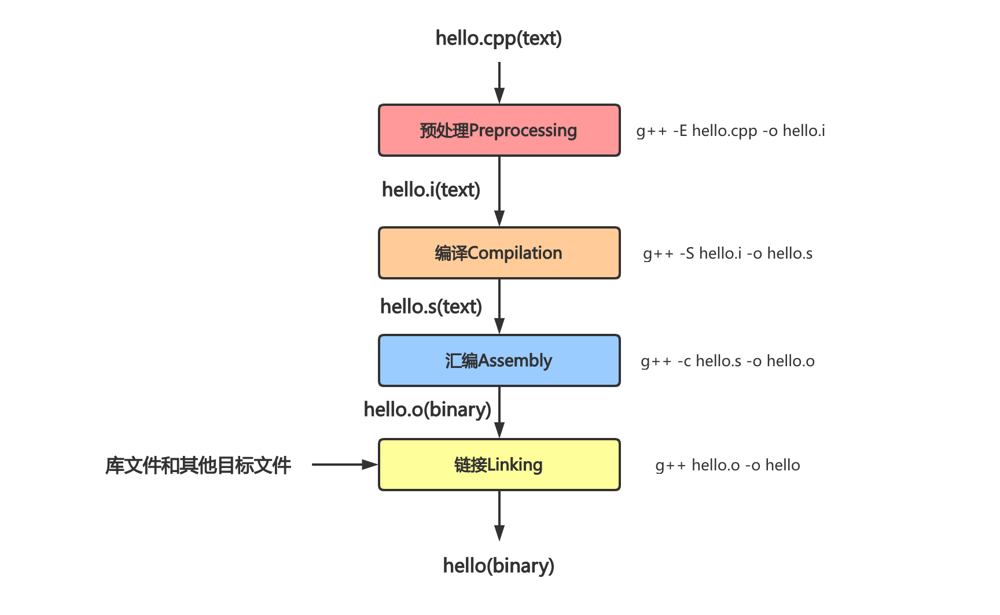

# gcc 编译原理

## 总结

* GCC 原名 GNU C 语言编译器（GNU C Compiler）， 后来由于 GCC 编译器支持多种编程语言，所以更名为 GNU Compiler Collection（GNU 编译器套件）
* GNU 编译器套件包含 C、C++、Objective-C、Java 和 Go 语言的编译器，以及这些语言的库（例如 libstdc++）

## gcc 和 g++ 的不同

g++ 和 gcc 指令包含几点不同：

* gcc 是 GCC 编译器的通用编译指令，可以根据文件后缀名自动推断出编译语言类型；而 g++ 无论目标文件的后缀是什么都会以编译 C++ 的方式编译目标文件
* 由于 C++ 的标准语法相当于 C 语言更加严格，因此对于不兼容 C++ 标准语法 `.c` 文件而言，使用 g++ 可能编译无法通过
* 如果在 `.cpp` 文件中使用了 C++ 标准库，那么 g++ 在编译 C++ 程序时可以轻松通过，但是 gcc 指令必须手动添加 -lstdc++ -shared-libgcc 等指令表明链接对应的 C++ 标准库
* 后缀是 `.cpp` 的，g++ 和 gcc 都会当作是 C 程序，而 g++ 当作是 c++ 程序

> 简单理解，g++ 和 gcc 都是 GCC 的调用指令，其中 g++ 等同于 gcc -xc++ -lstdc++ -shared-libgcc。我们最好使用 gcc 编译 C 程序，使用 g++ 编译 C++ 程序。

编译阶段 g++ 会调用 gcc，因此两者在编译期间等价，但是 gcc 命令不能自动和 C++ 程序使用的库链接，所以通常用 g++ 来链接 C++ 程序。为了统一起见，干脆编译和链接 C++ 程序就都采用 g++ 了。当然你也可以在链接时使用 gcc -lstdc++。

## 安装

注意安装版本需要 > 4.8.5，以支持 C++11 新标准。

```bash
# 安装
sudo apt install gcc g++

# 查看版本
gcc -v
g++ -v
```

## 用法

```bash
g++ -g main.cc -o main
```

## 编译原理

程序员编写完代码后，编译工具 GCC 将 C++ 等高级语言“翻译”成低级语言（汇编语言甚至是机器码），进而形成可执行文件。

gcc 指令编译 `.cpp` 文件主要包含四个流程：预处理 Preprocessing、编译 Compilation、汇编 Assembly 和链接 Linking。

以最简单的一个 C++ 程序 `hello.cpp` 为例：

```c++
#include <iostream>

int main() {
    std::cout << "Hello, world!" << std::endl;
    return 0;
}
```



## 预编译

预编译过程主要处理那些源码文件中的以「#」开头的预编译指令。比如 `#include` 和 `#define` 等。

* 将所有的 `#define` 删除，并且展开所有的宏定义
* 处理所有的条件预编译指令，比如 `#if`、`#ifdef`、`#elif`、`#else` 和 `#endif`
* 处理 `#include` 预编译指令，将被包含的文件插入到该预编译指令的位置。注意，这个过程是递归进行的，也就是说被包含的文件可能还包含其他文件。
* 删除所有的注释 `//` 和 `/**/`
* 添加行号和文件名标识，以便于编译时编译器产生调试用的行号信息及用于编译时产生编译错误或警告时能显示行号。
* 保留所有的 `#pragma` 编译器指令，因为编译器需要使用它们。

### 1. 宏

C++ 中用 `#define <宏名> <字符串>` 命令定义宏，在代码中将字符串替换宏名出现的位置。定义宏的方式根据是否包含参数可以分为两种：

```c++
#define <宏名> <字符串>
#define PI 3.1415926

#define <宏名>(<参数列表>) <宏体>
#define A(x) x
```

#### 1.1 使用宏的原因

在预处理阶段的宏替换仅仅是将目标字符串替换宏名，在代码中对宏的使用必须极其谨慎，否则很容易写出有问题的程序。定义宏的主要有两个场景：

* 通过宏定义常量：在常量变更时仅需要修改宏的定义而不需要修改所有使用到常量的位置
* 带参数的宏可以减少系统调用函数的开销：对于一些特别简单的函数而言，函数的调用开销不可忽视，带参数的宏在预处理阶段就进行了宏展开，提高了程序的运行效率

#### 1.2 宏定义中的三个特殊符号

宏定义包含三个特殊符号：

* `x##y`：将 `x` 和 `y` 拼接到一起
* `#@x`：给 `x` 加上单引号，返回 `const char`
* `#x`：给 `x` 加上双引号

```c++
#define Cat(x,y) x##y
#define ToChar(x) #@x
#define ToString(x) #x
```

### 2. 条件编译

条件编译的指令包括 `#ifdef`、`#ifndef`、`else`、`elif` 和 `#endif` 等。

> 条件编译类似于程序中 `if else` 语句，会选择性执行对应的代码。不过前者是在预编译阶段执行的条件选择，后者是在程序运行时执行的条件选择。

#### 2.1 头文件保护符

头文件通常包含那些只能被定义一次的实体，如类、`const` 和 `constexpr` 变量等，C++ 会使用头文件保护符来防止包含多份相同的头文件：

```c++
/*
foo.h
*/
#ifndef FOO_H
#define FOO_H

// ...

#endif
```

##### 2.2 跨平台编译

条件编译另一个常用场景即跨系统开发时兼容不同的平台。比如：

```c++
#if _WIN32
// windows下的逻辑
#elif __linux__
// linux下的逻辑
#else
// 其他平台
#endif
```

#### 3. 展开头文件

在 C++ 中调用一个函数之前必须先有函数的声明，因此我们将各种要调用的函数声明打包成头文件，在 `.cpp` 文件的开头 `#include` 该头文件就可以保证声明置于调用之前。举个例子，C++ 中 `#include "foo.h"` 语句的含义是在预处理阶段用 `foo.h` 文件的内容插入到这条语句的位置。

> C++ 中包含头文件可以写成 `#include <foo.h>` 或者 `#include "foo.h"`，这两者表示编译器搜索头文件的顺序不同：
>
> * `<foo.h>` 表示从系统目录下开始搜索，再搜索 `$PATH` 环境变量的目录，不搜索当前目录
> * `"foo.h"` 表示从当前目录开始搜索，然后是系统目录和 `$PATH` 环境变量的目录
>
> 如果我们知道文件不在当前目录下的话，可以通过 `<foo.h>` 来加快搜索速度。

## 编译

> 编译指的是将预处理阶段获得的程序代码，经过一系列的词法分析、语法分析、语义分析以及优化，加工成当前机器支持的汇编代码。

需要注意的是编译阶段是以一个单独的 `.cpp` 文件作为编译单元的（每个 `.cpp` 源文件对应一个 `.o` 目标文件），这意味着我们在编译 `.cpp` 时可以调用一个函数而不必给出函数的定义（但必须在调用之前获得函数的声明）。事实上 `.cpp` 前面 `#include` 的文件往往也只给出了函数的声明，至于函数是如何定义的需要等到链接 Linking 阶段再去找到函数的入口地址。

### 1. 编译的主要含义

编译阶段可以认为主要分成两步：

* 检查函数和变量是否存在声明
* 检查语句是否符合 C++ 语法

### 2. 编译的步骤

> Q：预处理阶段已经删掉注释了，为什么编译阶段步骤三内还包含源文件的注释？
>
> A：这里的“编译”指的是广义的编译，包含前面提到的预编译步骤

标准 C 和 C++ 将编译过程定义为 9 个阶段：

#### 2.1 Phase1：字符映射

源文件的字符被映射到源字符集中，特别是依赖于操作系统的行尾指示符会被换行符替换。其中源字符集由如下 96 个字符组成：

* 5 种空格字符：空格、水平制表符、垂直制表符、换页符和换行符
* `0~9` 的十个数字符号
* `a~z` 和 `A~Z` 的 52 个英文字母符号
* 29 个标点符号 `_ { } [ ] # ( ) < > % : ; . ? * + - / ^ & | ~ ! = , \ " ’`

#### 2.2 Phase2：反斜杠行合并

以反斜杠 `\` 结束的行会和它接下来的行进行合并。

#### 2.3 Phase3：标记化

源文件会被分解成注释、空白字符序列（空格、水平制表符、垂直制表符、换页符和换行符）以及预处理标记。

#### 2.4 Phase4：预处理

执行预处理器进行宏展开（使用 `#include` 指令引入的每个文件都会递归地执行前面的 Phase1~4）。这个阶段结束后，所有预处理器指令都会从源代码删除。

#### 2.5 Phase5：字符集映射

源字符集成员和转义序列被转换为他们在执行字符集中的等价符号，对于微软 C 和 C++，源字符集和执行字符集都是 ASCII。

#### 2.6 Phase6：字符串连接

相邻的字符串会被连接到一起。

#### 2.7 Phase7：翻译

在语法和语义上分析所有的符号，翻译成目标代码。

#### 2.8 Phase8：处理模板

处理模板实例。

#### 2.9 Phase9：连接

所有的外部引用均被解析以创建可执行文件或者动态链接库。

## 汇编

汇编是将前一步得到的 `.s` 汇编语言文件翻译成 `.o` 二进制机器指令文件的过程。

## 链接

到目前为止，我们将每个 `.cpp` 源文件都编译成一个 `.o` 二进制目标文件，但是这些文件并不能被执行（因为某个源文件生成的 `.o` 文件中可能引用了另一个 `.o` 文件或者某个库文件的符号，比如变量或者函数调用等）。

链接是编译的最后一步，会将前面编译好的 `.o` 文件、系统库的 `.o` 文件和库文件彼此相连接，把某个目标文件中引用的符号同另一个文件中的定义链接起来，将所有编译好的单元组成一个可执行文件。

> 由于前面编译单元都是单个 `.cpp` 文件，因此直到链接阶段才能检查全局空间是否存在 **重复定义或者缺失定义** 的问题。这也是为什么我们一般不在头文件中出现定义的原因，因为头文件可能被多个源文件包含，每个源文件单独编译后就会在全局空间出现多个定义。

### 1. 动态链接

动态链接在编译链接时并不会把库文件的代码加到可执行文件中，而是在运行时加载所需要的动态库。动态链接生成的程序往往占用空间更小，但是系统环境缺少所需的动态库则无法运行。动态库文件一般后缀名为 `.so`。

### 2. 静态链接

与动态链接相反，静态链接在编译链接阶段就将库文件的所有代码加到可执行文件中，因此生成的程序体积更大，其后缀名一般为 `.a`。

## gcc 常用参数选项

| gcc 编译选项       | 说明                                                         |
| ------------------ | ------------------------------------------------------------ |
| -E                 | 预处理指定的源文件，不进行编译                               |
| -S                 | 编译指定的源文件，但不进行汇编                               |
| -c                 | 编译、汇编指定的源文件，但是不进行链接                       |
| -o [file1] [file2] | 将文件 file2 编译成可执行文件 file1                          |
| -I directory       | 指定 include 包含文件的搜索目录                              |
| -g                 | 在编译的时候生成调试信息，该程序可以被调试器调试             |
| -D                 | 在程序编译的时候指定一个宏                                   |
| -w                 | 不生成任何警告信息                                           |
| -Wall              | 生成所有的警告信息                                           |
| -On                | n 取值范围为 0 ~ 3，表示编译器优化选项的 4 个级别，-O0 表示没有优化，-O1 为缺省值，-O3 优化级别最高 |
| -l                 | 在程序编译的时候指定使用的库                                 |
| -L                 | 指定编译的时候搜索的库路径                                   |
| -fPIC/fpic         | 生成与位置无关的代码                                         |
| -shared            | 生成共享目标文件，通常用在建立共享库时                       |
| -std               | 指定 C 方案，如 -std=c99，gcc 默认的方言是  GNU C            |

## Reference

[1] <https://blog.csdn.net/Zhangyanfeng1/article/details/111028540>

[2] <https://blog.csdn.net/weixin_42517021/article/details/104363967>

[3] <http://c.biancheng.net/view/7930.html>

[4] <http://c.biancheng.net/view/7936.html>

[5] <https://blog.csdn.net/Zhangyanfeng1/article/details/110928755>

[6] <https://cloud.tencent.com/developer/article/1176744>

[7] <https://blog.csdn.net/elfprincexu/article/details/45043971>

[8] <https://blog.csdn.net/qq_43133135/article/details/82865618>

[9] <https://www.cnblogs.com/fnlingnzb-learner/p/6903966.html>

[10] <http://www.cppblog.com/woaidongmao/archive/2008/11/08/66311.html>

[11] <https://www.cnblogs.com/CarpenterLee/p/5994681.html#top>
