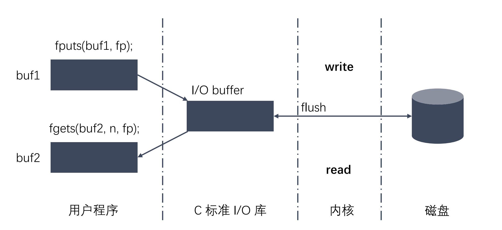
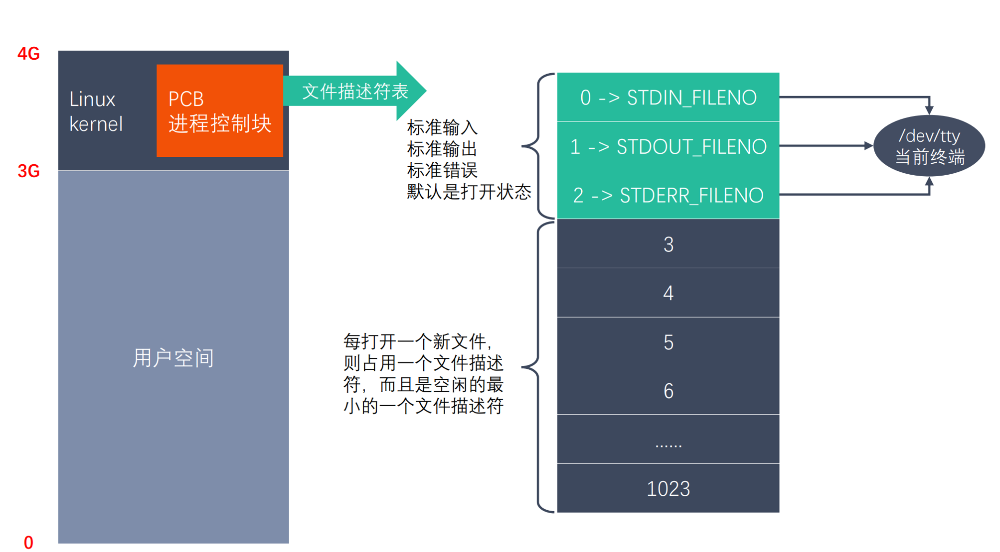
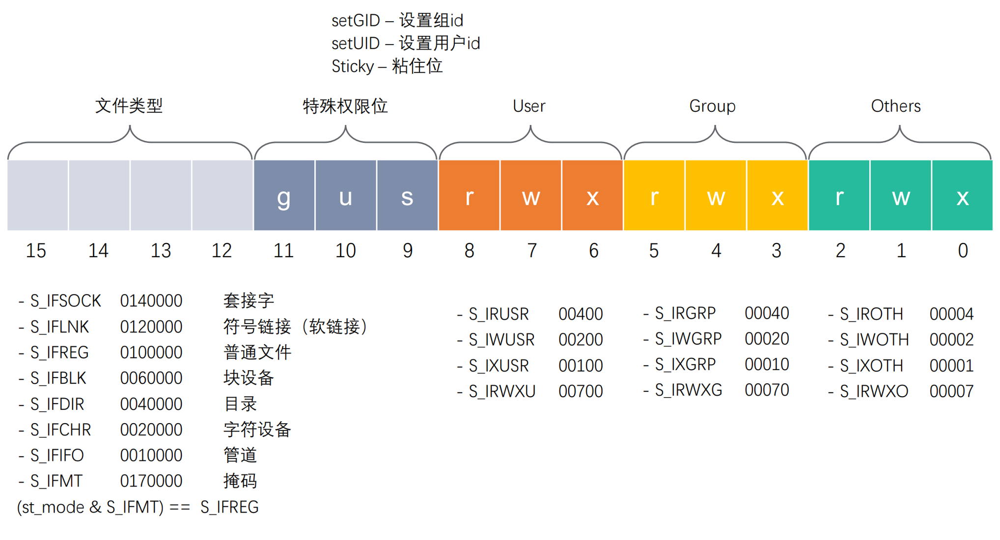

# 文件 IO

## 标准 C 库 IO 函数

标准 C 库可以跨平台访问，其 IO 函数如下：


标准 C 库 IO 和 Linux 系统 IO 的关系如下：



## 文件描述符

文件描述符是一个非负整数，用于指代打开的文件，内核用文件描述符来标识不同的文件。



* 内核空间中的 PCB 进程控制块管理文件描述符表
* 每打开的一个新文件则占用一个文件描述符，而且是空闲的最小的一个文件描述符
* 文件描述符表是一个数组，默认的大小是 1024，即最多能打开 1024 个文件

## 打开文件

```c++
// 打开一个已经存在的文件
// 参数:
//   - pathname: 要打开的文件路径
//   - flags: 堆文件操作权限设置还有其他设置, O_RDONLY, O_WRONLY, O_RDWR, 这三者是互斥的
// 返回值: 放回一个新的文件描述符, 如果调用失败则返回 -1
int open(const char *pathname, int flags);

// 创建一个新的文件
// 参数
//   - pathname: 要打开的文件路径
//   - flags: 堆文件操作权限设置还有其他设置
//      - 必选项: O_RDONLY, O_WRONLY, O_RDWR, 这三者是互斥的
//      - 可选项: O_CREAT 表示文件不存在时创建新文件
//   - mode: 八进制的数, 表示创建出的文件的操作权限, 最终创建的权限是: mode & ~umask, umask 用于抹去某些权限
int open(const char *pathname, int flags, mode_t mode);
// 例子
int fd = open("./test.txt", O_RDWR | O_CREAT, 0777);
```

如果返回值非 0，那么 errno 会被设置为相应的错误码。可以通过 `perror` 打印 errno 对应的错误描述。

## 读文件

```c++
#include <unistd.h>

// 参数
//   - fd: 文件描述符
//   - buf: 读入的数据存储的缓冲区
//   - count: 需要读取的字节数
// 返回值:
//   - 成功:
//      >0: 返回实际读到的字节数
//      =0: 文件已读完
//   - 失败: 返回 -1 并设置 errno
ssize_t read(int fd, void *buf, size_t count);
```

## 写文件

```c++
#include <unistd.h>

// 参数
//   - fd: 文件描述符
//   - buf: 写入的数据存储的缓冲区
//   - count: 需要写入的字节数
// 返回值:
//   - 成功: 返回写入的字节数
//   - 失败: 返回 -1 并设置 errno
ssize_t write(int fd, const void *buf, size_t count);
```

## lseek 函数

```c++
// 标准 C 库
#include <stdio.h>
int fseek(FILE *stream, long offset, int whence);

// Linux 系统函数
#include <sys/types.h>
#include <unistd.h>
// 参数
//   - fd: 文件描述符
//   - offset: 偏移量, 单位: 字节
//   - whence: 偏移量从哪里开始计算
//      - SEEK_SET: 从文件开头开始计算
//      - SEEK_CUR: 从当前位置开始计算
//      - SEEK_END: 从文件末尾开始计算
off_t lseek(int fd, off_t offset, int whence);

// 1. 移动文件指针到文件头
lseek(fd, 0, SEEK_SET);
// 2. 获取当前文件指针的位置
lseek(fd, 0, SEEK_CUR);
// 3. 获取文件长度
lseek(fd, 0, SEEK_END);
// 4. 拓展文件的长度, 假设当前文件 10b, 需要增加 100 个字节到 110b
lseek(fd, 100, SEEK_END);
```

## stat 函数

```c++
$ stat logger/logger.h 
  File: logger/logger.h
  Size: 1122            Blocks: 8          IO Block: 4096   regular file
Device: 10305h/66309d   Inode: 1716412     Links: 1
Access: (0664/-rw-rw-r--)  Uid: ( 1000/     cat)   Gid: ( 1000/     cat)
Access: 2023-08-26 02:13:59.521194635 +0800
Modify: 2023-08-26 02:13:59.473194039 +0800
Change: 2023-08-26 02:13:59.473194039 +0800
 Birth: 2023-08-25 21:06:20.924492678 +0800
```

```c++
#include <sys/types.h>
#include <sys/stat.h>
#include <unistd.h>

// 作用: 获取文件相关信息
// 参数:
//   - path: 文件路径
//   - buf: 文件信息结构体
// 返回值:
//   - 成功: 0
//   - 失败: -1, 设置 errno
int stat(const char *path, struct stat *buf);

// 作用: 获取软链接文件相关信息
// 参数:
//   - path: 文件路径
//   - buf: 文件信息结构体
// 返回值:
//   - 成功: 0
//   - 失败: -1, 设置 errno
int lstat(const char *path, struct stat *buf);
```

其中 stat 的内容如下：

```c++
struct stat {
    dev_t st_dev;         // 文件的设备编号
    ino_t st_ino;         // 节点
    mode_t st_mode;       // 文件的类型和存取的权限
    nlink_t st_nlink;     // 连到该文件的硬连接数目
    uid_t st_uid;         // 用户ID
    gid_t st_gid;         // 组ID
    dev_t st_rdev;        // 设备文件的设备编号
    off_t st_size;        // 文件字节数(文件大小)
    blksize_t st_blksize; // 块大小
    blkcnt_t st_blocks;   // 块数
    time_t st_atime;      // 最后一次访问时间
    time_t st_mtime;      // 最后一次修改时间
    time_t st_ctime;      // 最后一次改变时间(指属性)
};

```

st_mode 的具体含义如下：



## 文件属性操作函数

```c++
// 作用: 判断某个文件是否具有某个权限, 或者判断文件是否存在
// 参数:
//   - pathname: 文件路径
//   - mode: 文件属性
//      R_OK: 判断是否具有读权限
//      W_OK: 判断是否具有写权限
//      X_OK: 判断是否具有执行权限
//      F_OK: 判断文件是否存在
// 返回值: 成功返回 0, 失败返回 -1, 设置 errno
int access(const char *pathname, int mode);

// 作用: 修改文件的权限
// 参数:
//   - pathname: 文件路径
//   - mode: 需要修改的权限值, 八进制
// 返回值: 成功返回 0, 失败返回 -1, 设置 errno
int chmod(const char *pathname, mode_t mode);

// 作用: 修改文件的拥有者
int chown(const char *pathname, uid_t owner, gid_t group);

// 作用: 缩减或者扩展文件的尺寸至指定的大小
int truncate(const char *path, off_t length);
```

## dup 和 dup2

```c++
// 作用: 复制文件描述符并返回一个新的文件描述符, 和 oldfd 指向同一个文件
int dup(int oldfd);

// 作用: 重定向文件描述符
// 假设 oldfd 指向 a.txt, newfd 指向 b.txt, 调用 dup2(oldfd, newfd) 之后, newfd 和 b.txt 做 close, newfd 指向 a.txt
int dup2(int oldfd, int newfd);
```

## fcntl

```c++
#include <unistd.h>
#include <fcntl.h>

// 参数:
//   - fd: 文件描述符
//   - cmd: 操作命令
//      F_DUPFD: 复制文件描述符并返回一个新的文件描述符, 和 oldfd 指向同一个文件
//      F_GETFD: 获取文件描述符的 flags
//      F_SETFD: 设置文件描述符的 flags
//        必选项: O_RDONLY, O_WRONLY, O_RDWR 不可以被修改
//        可选项: O_APPEND, ONONBLOCK
int fcntl(int fd, int cmd, ...);
```
