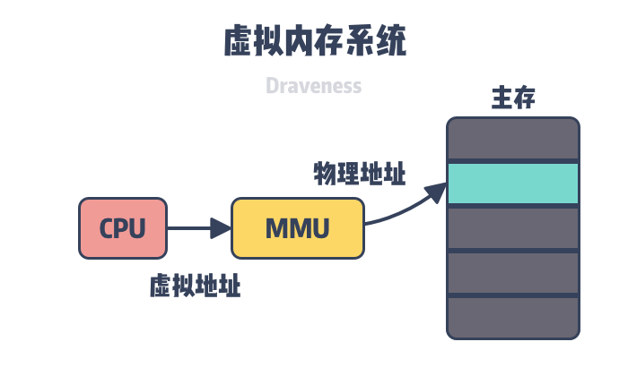
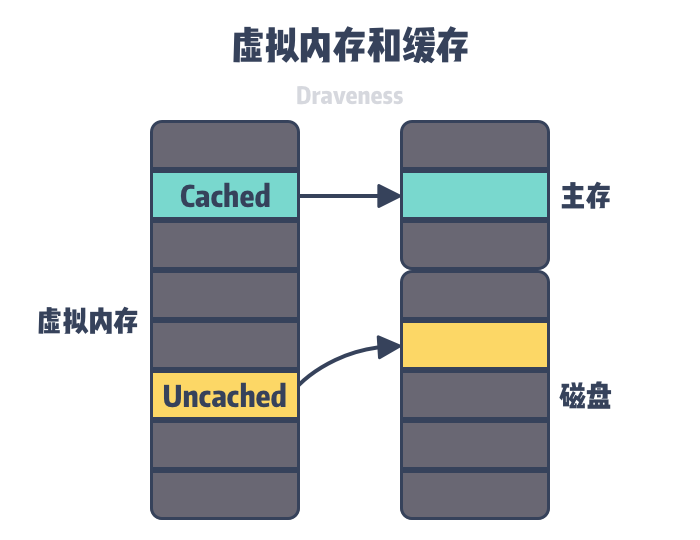
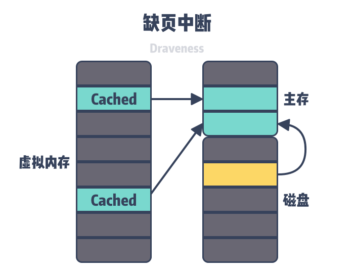
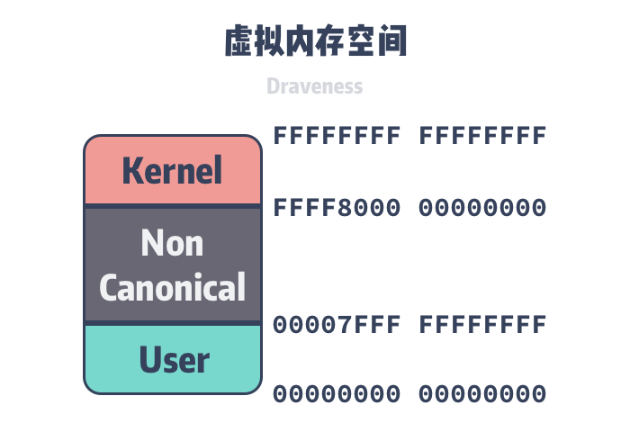
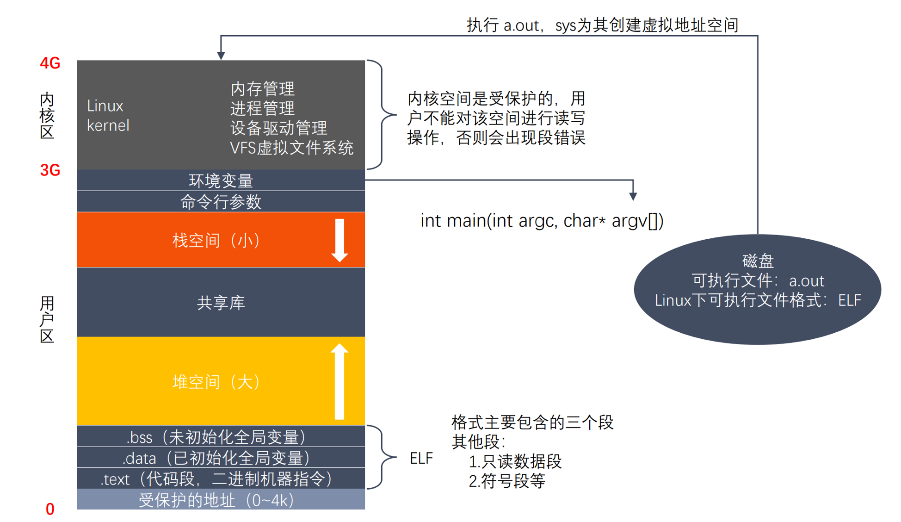

# 虚拟内存

## 引言

操作系统中的 CPU 和主内存（Main memory）都是稀缺资源，所有运行在当前操作系统的进程会共享系统中的 CPU 和内存资源，操作系统会使用 CPU 调度器分配 CPU 时间并引入虚拟内存系统以管理物理内存，本文会分析操作系统为什么需要虚拟内存。

## 简介

在回答虚拟内存存在的必要性之前，我们需要理解操作系统中的虚拟内存是什么，它在操作系统中起到什么样的作用。正如软件工程中的其他抽象，**虚拟内存是操作系统物理内存和进程之间的中间层**，它为进程隐藏了物理内存这一概念，为进程提供了更加简洁和易用的接口以及更加复杂的功能。

如果需要我们从头设计一个操作系统，让系统中的进程直接访问主内存中的物理地址应该是非常自然的决定，早期的操作系统确实也都是这么实现的，进程会使用目标内存的物理地址（Physical Address）直接访问内存中的内容，然而现代的操作系统都引入了虚拟内存，进程持有的虚拟地址（Virtual Address）会经过内存管理单元（Memory Management Unit）的转换变成物理地址，然后再通过物理地址访问内存：

主存储是相对比较稀缺的资源，虽然顺序读取只比磁盘快 1 个数量级，但是它能提供极快的随机访问速度，从内存上随机读取数据是磁盘的 100,000 倍3，充分利用内存的随机访问速度是改善程序执行效率的有效方式。

操作系统以页为单位管理内存，当进程发现需要访问的数据不在内存时，操作系统可能会将数据以页的方式加载到内存中，这个过程是由上图中的内存管理单元（MMU）完成的。操作系统的虚拟内存作为一个抽象层，起到了以下三个非常关键的作用：

- 虚拟内存可以利用内存起到缓存的作用，提高进程访问磁盘的速度；
- 虚拟内存可以为进程提供独立的内存空间，简化程序的链接、加载过程并通过动态库共享内存；
- 虚拟内存可以控制进程对物理内存的访问，隔离不同进程的访问权限，提高系统的安全性；

## 缓存

我们可以将虚拟内存看作是在磁盘上一片空间，当这片空间中的一部分访问比较频繁时，**该部分数据会以页为单位被缓存到主存中**以加速 CPU 访问数据的性能，虚拟内存利用空间较大的磁盘存储作为『内存』并使用主存储缓存进行加速，**让上层认为操作系统的内存很大而且很快，然而区域很大的磁盘并不快，而很快的内存也并不大**。

虚拟内存中的虚拟页（Virtual Page，VP）可能处于以下的三种状态 — 未分配（Unallocated）、未缓存（Uncached）和已缓存（Cached），其中未分配的内存页是没有被进程申请使用的，也就是空闲的虚拟内存，不占用虚拟内存磁盘的任何空间，未缓存和已缓存的内存页分别表示仅加载到磁盘中的内存页和已经加载到主存中的内存页。如上图所示，图中绿色的虚拟内存页由主存中的物理内存页（Physical Page，PP）支撑，所以它是已经缓存过的，而黄色的虚拟内存页仅在磁盘中，所以没有被物理内存缓存。

当用户程序访问未被缓存的虚拟页时，硬件就会触发缺页中断（Page Fault，PF），**在部分情况下，被访问的页面已经加载到了物理内存中，但是用户程序的页表（Page Table）并不存在该对应关系，这时我们只需要在页表中建立虚拟内存到物理内存的关系；在其他情况下，操作系统需要将磁盘上未被缓存的虚拟页加载到物理内存中**。

因为主内存的空间是有限的，当主内存中不包含可以使用的空间时，操作系统会从选择合适的物理内存页驱逐回磁盘，为新的内存页让出位置，选择待驱逐页的过程在操作系统中叫做页面替换（Page Replacement）。缺页中断和页面替换技术都是操作系统调页算法（Paging）的一部分，该算法的目的就是充分利用内存资源作为磁盘的缓存以提高程序的运行效率。

## 内存管理

虚拟内存可以为正在运行的进程提供独立的内存空间，制造一种每个进程的内存都是独立的假象，在 64 位的操作系统上，每个进程都会拥有 256 TiB 的内存空间，内核空间和用户空间分别占 128 TiB。因为每个进程的虚拟内存空间是完全独立的，所以它们都可以完整的使用 0x0000000000000000 到 0x00007FFFFFFFFFFF 的全部内存。

虚拟内存空间只是操作系统中的逻辑结构，就像我们上面说的，应用程序最终还是需要访问物理内存或者磁盘上的内容。因为操作系统加了一个虚拟内存的中间层，所以我们也需要为进程实现地址翻译器，实现从虚拟地址到物理地址的转换，页表是虚拟内存系统中的重要数据结构，每一个进程的页表中都存储了从虚拟内存到物理内存页的映射关系，为了存储 64 位操作系统中 128 TiB 虚拟内存的映射数据，Linux 在 2.6.10 中引入了四层的页表辅助虚拟地址的转换。

在 4.11 中引入了五层的页表结构，在未来还可能会引入更多层的页表结构以支持 64 位的虚拟地址。

在如上图所示的四层页表结构中，操作系统会使用最低的 12 位作为页面的偏移量，剩下的 36 位会分四组分别表示当前层级在上一层中的索引，所有的虚拟地址都可以用上述的多层页表查找到对应的物理地址。

因为有多层的页表结构可以用来转换虚拟地址，所以多个进程可以通过虚拟内存共享物理内存。我们在 [为什么 Redis 快照使用子进程](https://draveness.me/whys-the-design-redis-bgsave-fork/) 一文中介绍的写时复制就利用了虚拟内存的这个特性，当我们在 Linux 中调用 `fork` 创建子进程时，实际上**只复制了父进程的页表**。如下图所示，父子进程会通过不同的页表指向相同的物理内存：

虚拟内存不仅可以在 `fork` 时用于共享进程的物理内存，提供写时复制的机制，还能共享一些常见的动态库减少物理内存的占用，所有的进程都可能调用相同的操作系统内核代码，而 C 语言程序也会调用相同的标准库。

除了能够共享内存之外，独立的虚拟内存空间也会简化内存的分配过程，当用户程序向操作系统申请堆内存时，操作系统可以分配几个连续的虚拟页，但是这些虚拟页可以对应到物理内存中不连续的页中。

## 内存保护

操作系统中的用户程序不应该修改只读的代码段，也不应该读取或者修改内核中的代码和数据结构或者访问私有的以及其他的进程的内存，如果无法对用户进程的内存访问进行限制，攻击者就可以访问和修改其他进程的内存影响系统的安全。

如果每一个进程都持有独立的虚拟内存空间，那么虚拟内存中页表可以理解成进程和物理页的『连接表』，其中可以存储进程和物理页之间的访问关系，包括读权限、写权限和执行权限：

内存管理单元可以决定当前进程是否有权限访问目标的物理内存，这样我们就最终将权限管理的功能全部收敛到虚拟内存系统中，减少了可能出现风险的代码路径。

## 虚拟地址空间

- 每个可执行程序对应一个虚拟地址空间
- 虚拟地址空间的大小由 CPU 决定，32 位 CPU 最大可以支持 4G （$2^{32}$）虚拟地址空间
- nullptr 在受保护的地址上

## 总结

虚拟内存的设计方法可以说是软件工程中的常见手段，通过结合磁盘和内存各自的优势，**利用中间层对资源进行更合理地调度充分提高资源的利用率并提供和谐以及统一的抽象**，而在实际的业务场景中，类似的缓存逻辑也比较常见。

操作系统的虚拟内存是非常复杂的组件，没有工程师能够了解其中的全部细节，不过了解虚拟内存的整体设计也很有价值，我们能够从中找到很多软件设计的方法。我们重新回到今天的问题 — Linux 操作系统中为什么需要虚拟内存：

- 虚拟内存可以结合磁盘和物理内存的优势为进程提供看起来速度足够快并且容量足够大的存储；
- 虚拟内存可以为进程提供独立的内存空间并引入多层的页表结构将虚拟内存翻译成物理内存，进程之间可以共享物理内存减少开销，也能简化程序的链接、装载以及内存分配过程；
- 虚拟内存可以控制进程对物理内存的访问，隔离不同进程的访问权限，提高系统的安全性；

## Reference

[1] <https://draveness.me/whys-the-design-os-virtual-memory/>
