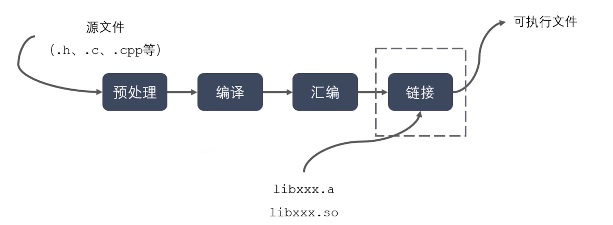
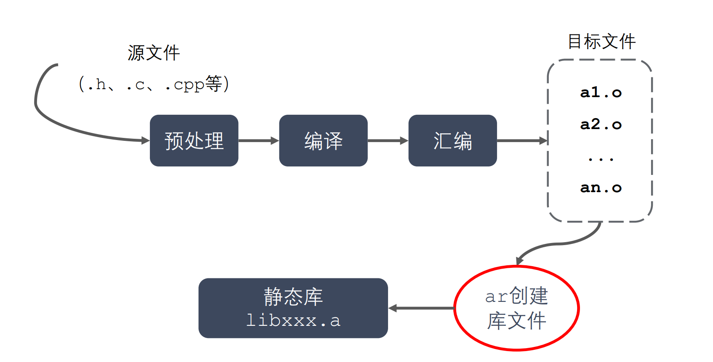
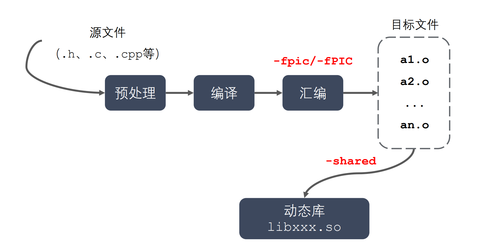
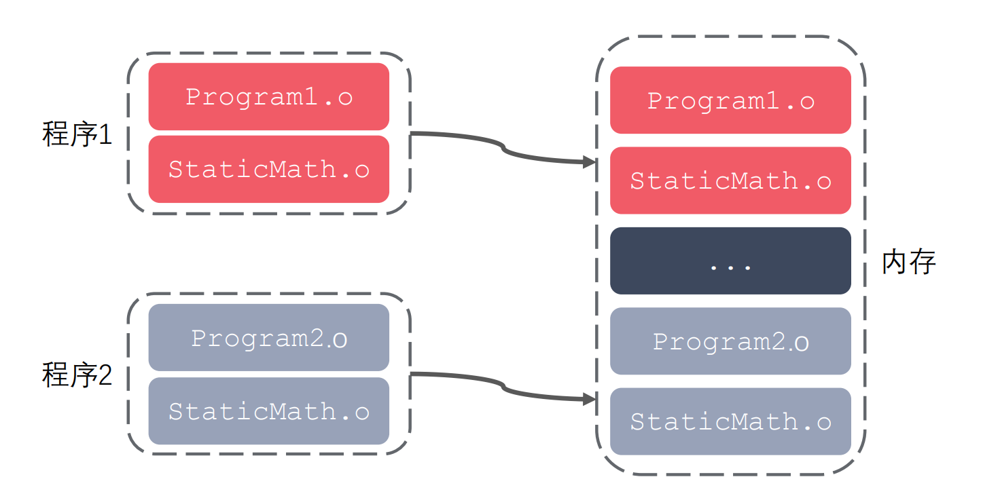
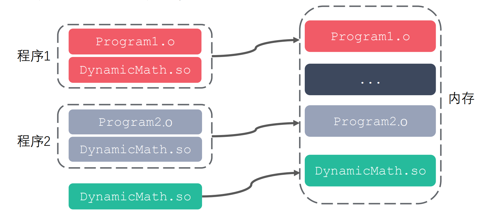

# 静态库与动态库区别

## 编译过程

静态库、动态库区别来自于链接阶段编译器如何链接成可执行程序，分别被称为静态链接方式和动态链接方式。

## 静态库制作过程

## 动态库制作过程

## 静态库优缺点

* 优点：
  * 静态库被打包到应用程序中，加载速度快
  * 发布程序无需提供静态库，移植方便
* 缺点：
  * 消耗系统资源，浪费内存
  * 更新、部署、发布麻烦

## 动态库优缺点

* 优点：
  * 可以实现进程间资源共享（共享库）
  * 更新、部署、发布简单
  * 可以控制何时加载动态库（未使用到时不会加载）
* 缺点：
  * 加载速度比静态库慢
  * 发布程序时需要提供依赖的动态库

