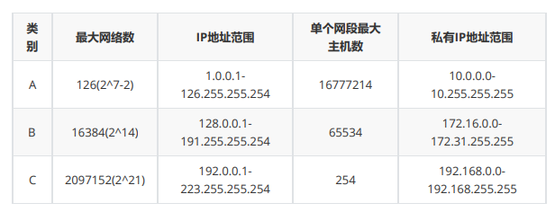

# IP

## 简介

IP 协议是为计算机网络相互连接进行通信而设计的协议。在因特网中，它是能使连接到网上的所有计算机网络实现相互通信的一套规则，规定了计算机在因特网上进行通信时应当遵守的规则。任何厂家生产的计算机系统，只要遵守 IP 协议就可以与因特网互连互通。各个厂家生产的网络系统和设备，如以太网、分组交换网等，它们相互之间不能互通，不能互通的主要原因是因为它们所传送数据的基本单元（技术上称之为“帧”）的格式不同。**IP 协议实际上是一套由软件程序组成的协议软件，它把各种不同“帧”统一转换成“IP 数据报”格式**，这种转换是因特网的一个最重要的特点，使所有各种计算机都能在因特网上实现互通，即具有“开放性”的特点。正是因为有了 IP 协议，因特网才得以迅速发展成为世界上最大的、开放的计算机通信网络。因此，IP 协议也可以叫做“因特网协议”。

IP 地址（Internet Protocol Address）是指互联网协议地址，又译为网际协议地址。IP 地址是 IP协议提供的一种统一的地址格式，它为互联网上的每一个网络和每一台主机分配一个**逻辑地址**，以此来屏蔽物理地址的差异。

IP 地址是一个 32 位的二进制数，通常被分割为 4 个“ 8 位二进制数”（也就是 4 个字节）。IP 地址通常用“点分十进制”表示成（a.b.c.d）的形式，其中，a,b,c,d都是 0~255 之间的十进制整数。
例：点分十进IP地址（100.4.5.6），实际上是 32 位二进制数（01100100.00000100.00000101.00000110）。

## IP 地址编码方式

最初设计互联网络时，为了便于寻址以及层次化构造网络，每个 IP 地址包括两个标识码（ID），即网络ID 和主机 ID。同一个物理网络上的所有主机都使用同一个网络 ID，网络上的一个主机（包括网络上工作站，服务器和路由器等）有一个主机 ID 与其对应。**Internet 委员会定义了 5 种 IP 地址类型以适合不同容量的网络**，即 A 类~ E 类。

其中 A、B、C 3类（如下表格）由 InternetNIC 在全球范围内统一分配，D、E 类为特殊地址。

### 1. A 类 IP 地址

一个 A 类 IP 地址是指， 在 IP 地址的四段号码中，第一段号码为网络号码，剩下的三段号码为本地计算机的号码。如果用二进制表示 IP 地址的话，A 类 IP 地址就由 1 字节的网络地址和 3 字节主机地址组成，网络地址的最高位必须是“0”。A 类 IP 地址中网络的标识长度为 8 位，主机标识的长度为 24 位，A类网络地址数量较少，有 126 个网络，每个网络可以容纳主机数达 1600 多万台。A 类 IP 地址 地址范围 1.0.0.1 - 126.255.255.254（二进制表示为：00000001 00000000 0000000000000001 - 01111111 11111111 11111111 11111110）。最后一个是广播地址。A 类 IP 地址的**子网掩码**为 255.0.0.0，每个网络支持的最大主机数为 256 的 3 次方 - 2 = 16777214 台

### 2. B 类 IP 地址

一个 B 类 IP 地址是指，在 IP 地址的四段号码中，前两段号码为网络号码。如果用二进制表示 IP 地址的话，B 类 IP 地址就由 2 字节的网络地址和 2 字节主机地址组成，网络地址的最高位必须是“10”。B 类 IP地址中网络的标识长度为 16 位，主机标识的长度为 16 位，B 类网络地址适用于中等规模的网络，有16384 个网络，每个网络所能容纳的计算机数为 6 万多台。B 类 IP 地址地址范围 128.0.0.1 - 191.255.255.254 （二进制表示为：10000000 00000000 0000000000000001 - 10111111 11111111 11111111 11111110）。 最后一个是广播地址。B 类 IP 地址的子网掩码为 255.255.0.0，每个网络支持的最大主机数为 256 的 2 次方 - 2 = 65534 台。

### 3. C 类 IP 地址

一个 C 类 IP 地址是指，在 IP 地址的四段号码中，前三段号码为网络号码，剩下的一段号码为本地计算机的号码。如果用二进制表示 IP 地址的话，C 类 IP 地址就由 3 字节的网络地址和 1 字节主机地址组成，网络地址的最高位必须是“110”。C 类 IP 地址中网络的标识长度为 24 位，主机标识的长度为 8 位，C 类网络地址数量较多，有 209 万余个网络。适用于小规模的局域网络，每个网络最多只能包含254台计算机。C 类 IP 地址范围 192.0.0.1-223.255.255.254 （二进制表示为: 11000000 00000000 0000000000000001 - 11011111 11111111 11111111 11111110）。C类IP地址的子网掩码为 255.255.255.0，每个网络支持的最大主机数为 256 - 2 = 254 台。

### 4. D 类 IP 地址

D 类 IP 地址在历史上被叫做多播地址（multicast address），即组播地址。在以太网中，多播地址命名了一组应该在这个网络中应用接收到一个分组的站点。多播地址的最高位必须是 “1110”，范围从224.0.0.0 - 239.255.255.255。

## 特殊网址

* 每一个字节都为 0 的地址（ “0.0.0.0” ）对应于当前主机；
* IP 地址中的每一个字节都为 1 的 IP 地址（ “255.255.255.255” ）是当前子网的广播地址；
* IP 地址中凡是以 “11110” 开头的 E 类 IP 地址都保留用于将来和实验使用。
* IP地址中不能以十进制 “127” 作为开头，该类地址中数字 127.0.0.1 到 127.255.255.255 用于回路测试，如：127.0.0.1可以代表本机IP地址。
